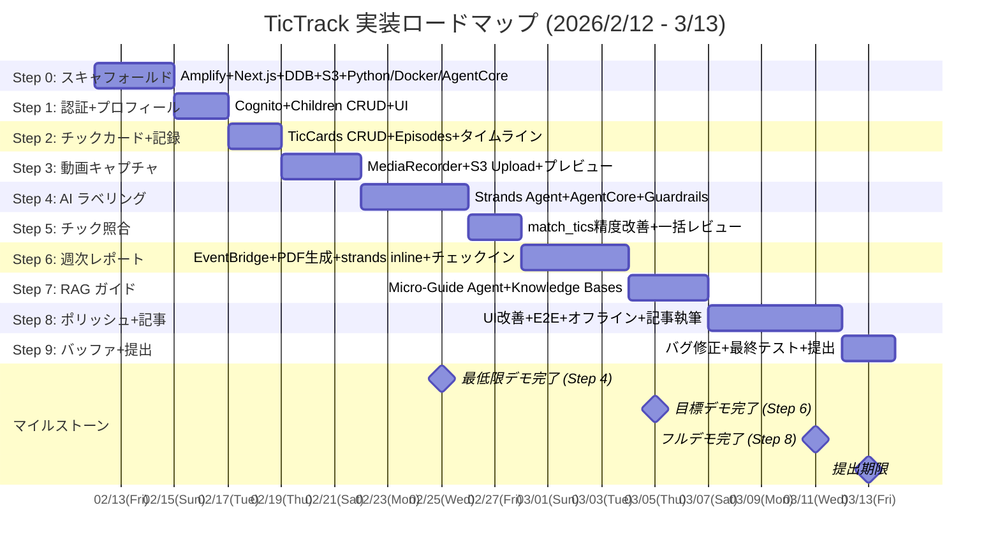

# TicTrack 実装ロードマップ

> **バージョン**: 2.0
> **作成日**: 2026-02-12
> **最終更新**: 2026-03-06（Strands Agents SDK + AgentCore Runtime 採用に伴う更新）
> **タイムライン**: 2026/2/12 → 2026/3/13（29 暦日、約 20 営業日）
> **開発者**: 1 名（個人開発）
> **参照**: `docs/design/architecture_final.md`（最終アーキテクチャ設計書）

---

## 概要

### プロジェクト概要

TicTrack は子どものチック症状を観察する保護者向けの **caregiver-first / non-diagnostic** PWA アプリケーション。AWS 10,000 AIdeas Competition セミファイナリスト・プロトタイプとして、2026/3/13 までに Builder Center 記事 + デモを公開する。

### タイムライン制約

| 項目 | 値 |
|------|-----|
| 開始日 | 2026/2/12（水） |
| 提出期限 | 2026/3/13（金）— プロトタイプ記事公開 + コミュニティ投票開始 |
| 暦日数 | 29 日 |
| 実質営業日 | 約 20 日（土日を考慮、ただし個人開発のため柔軟に稼働可能） |

### 開発アプローチ

- **TDD（テスト駆動開発）**: Red-Green-Refactor サイクルを徹底
- **Kiro Spec-driven 開発**: Kiro の Requirements → Design → Implementation ワークフローを活用
- **インクリメンタル MVP**: 各ステップが動作する MVP インクリメントを生成
- **AWS Free Tier + Bedrock $200 クレジット**: コスト制約内で開発

---

## MVP ティア定義

### 最低限デモ (Minimum Demo) — Steps 0-4

**スコープ**: 認証 + チックカード + 動画キャプチャ + AI ラベリング

**デモシナリオ**:
1. ユーザー登録 → ログイン → 子ども登録
2. チックカード「首振り」を作成 → ワンタップで発生記録
3. 動画撮影 → S3 アップロード → AI が「運動チック、重さ 2、就寝前」とラベル提案
4. 親がラベルを確認/編集 → フィードバック記録

**判定基準**: AI 動画分析のコアバリューをデモ可能であること。

---

### 目標デモ (Target Demo) — Steps 0-6

**スコープ**: 最低限デモ + 既出チック照合 + 週次レポート

**デモシナリオ**（追加分）:
5. 新しい動画 → AI が「既存の"首振り"と一致（85%）」と提案 → 親が確認
6. 1 週間分のデータ → PDF 自動生成 → ダウンロード

**判定基準**: 記録→分析→レポートの完全なループをデモ可能であること。

---

### フルデモ (Full Demo) — Steps 0-8

**スコープ**: 目標デモ + RAG マイクロガイド + ポリッシュ

**デモシナリオ**（追加分）:
7. 「就寝前のチックが増えた」というコンテキスト → 関連ガイド表示 → 出典リンク付き
8. UI/UX が整った状態で E2E フローを実演

**判定基準**: 全 3 フェーズの機能をデモ可能で、Builder Center 記事として公開に耐えうる品質であること。

---

## 実装ステップ

### Step 0: プロジェクトスキャフォールド (Day 1-3)

**目標**: デプロイ済みの空アプリケーション + Python Agent 開発環境

**作業内容**:
- Kiro でプロジェクト初期化（Spec-driven ワークフロー開始）
- Amplify Gen 2 + Next.js 14（App Router）セットアップ
- DynamoDB テーブル作成（Amplify Data / CDK: Users, Children, TicCards, Episodes, AILabels, CheckIns, WeeklyReports, ShareTokens）
- S3 バケット作成（`tictrack-media-{env}`, `tictrack-knowledge-{env}`）
- CI/CD パイプライン（Amplify Hosting: `git push` → 自動ビルド → デプロイ）
- テスト基盤セットアップ（Vitest + React Testing Library + Playwright）
- Serwist PWA 基本設定（マニフェスト + Service Worker 登録）
- Linter / Formatter 設定（ESLint + Prettier）
- Tailwind CSS + shadcn/ui セットアップ（Tailwind v4 互換性確認、問題あれば v3 固定）
- **Python 3.12 + uv（パッケージマネージャ）セットアップ**
- **`agents/` ディレクトリ構造作成**（tic_labeling/, micro_guide/, tests/）
- **Strands Agents SDK インストール**（`pip install strands-agents strands-agents-tools`）
- **Docker + ECR セットアップ**（AgentCore デプロイ用 ARM64 コンテナ）
- **AgentCore CLI インストール・初期設定**
- **pytest + moto テスト基盤セットアップ**（Python Agent テスト用）

**MVP**: ブラウザでアクセス可能なデプロイ済み空アプリ（PWA マニフェスト付き）+ Python Agent 開発環境

**TDD テスト項目**:
- [ ] `npm run build` がエラーなしで完了すること
- [ ] デプロイ URL にアクセスして HTTP 200 が返ること
- [ ] PWA マニフェストの `name`, `short_name`, `start_url`, `display` が正しく設定されていること
- [ ] Service Worker が正常に登録されること
- [ ] DynamoDB テーブルが全 8 テーブル作成されていること（GSI 含む）
- [ ] S3 バケットがパブリックアクセスブロック有効で作成されていること
- [ ] Python 3.12 環境で `strands-agents` がインポートできること
- [ ] Docker ビルドが成功すること（ARM64 ターゲット）
- [ ] ECR リポジトリが作成されていること

---

### Step 1: 認証 + ユーザー/子どもプロフィール (Day 2-4)

**目標**: サインアップ → ログイン → 子ども登録の完全フロー

**作業内容**:
- Cognito 設定（Amplify Auth — メール/パスワード認証）
- サインアップ/ログイン/ログアウト UI（Amplify UI Components 活用）
- COPPA 対応: サインアップ時の保護者確認 + データ収集同意チェックボックス
- Children CRUD API（Lambda: GET/POST/PUT/DELETE `/children`）
- Children 管理 UI（子ども一覧・追加・編集・削除）
- プロフィール設定ページ（`/settings`）
- API Gateway + Cognito Authorizer 設定

**MVP**: ユーザー登録 → ログイン → 子ども「タロウ」追加 → プロフィール確認 → ログアウト

**TDD テスト項目**:
- [ ] メールアドレス + パスワードでサインアップが成功すること
- [ ] 登録済みユーザーでログインが成功し、JWT トークンが取得できること
- [ ] ログアウト後にトークンが無効化されること
- [ ] 子どもの作成（POST `/children`）で `childId`（ULID）が返されること
- [ ] 子どもの一覧取得（GET `/children`）でログインユーザーの子どものみが返ること
- [ ] 子どもの更新（PUT `/children/{childId}`）で `displayName` が変更されること
- [ ] 子どもの削除（DELETE `/children/{childId}`）で該当レコードが消えること
- [ ] 認証トークンなしの API リクエストが 401 Unauthorized を返すこと
- [ ] 他のユーザーの子どもへのアクセスが 403 Forbidden を返すこと
- [ ] `displayName` が空文字の場合にバリデーションエラー（400）が返されること
- [ ] `birthYearMonth` のフォーマットが `YYYY-MM` 以外の場合にバリデーションエラーが返されること

---

### Step 2: チックカード管理 + ワンタップ記録 (Day 4-6)

**目標**: チックカード作成 → ワンタップでエピソード記録 → タイムライン表示

**作業内容**:
- TicCards CRUD API（Lambda: GET/POST/PUT/DELETE `/children/{childId}/tic-cards`）
- TicCards 管理 UI（カード追加・編集・削除、`/tic-cards`）
- Episodes API（POST `/children/{childId}/episodes` — `recordType: "quick_log"` でワンタップ記録）
- Episodes 一覧 API（GET `/children/{childId}/episodes?from=&to=` — 日付範囲検索）
- ダッシュボード/タイムライン UI（`/` — エピソード日別一覧）
- ワンタップ記録ボタン（チックカード選択 → 即時記録）

**MVP**: チックカード「首振り」を作成 → ワンタップで発生記録 → タイムラインに「2/6 14:30 首振り」と表示

**TDD テスト項目**:
- [ ] チックカード作成（POST）で `cardId`（ULID）, `label`, `type`（motor/vocal）, `severity`（1-3）が正しく保存されること
- [ ] チックカード一覧取得（GET）で指定した `childId` のカードのみが返ること
- [ ] チックカード更新（PUT）で `label` と `severity` が変更されること
- [ ] チックカード削除（DELETE）で該当レコードが消えること
- [ ] ワンタップ記録（POST `/episodes`、`recordType: "quick_log"`）でエピソードが作成され、`occurredAt` が ISO 8601 形式であること
- [ ] ワンタップ記録に `ticCardId` が正しく紐づくこと
- [ ] エピソード一覧取得で `from` / `to` パラメータによる日付範囲フィルタが正しく機能すること
- [ ] タイムラインがエピソードを `occurredAt` 降順で表示すること
- [ ] 子ども A のチックカードが子ども B のエピソードに紐づかないこと（cross-child isolation）
- [ ] `severity` が 0 以下または 4 以上の場合にバリデーションエラーが返されること
- [ ] `type` が `motor` / `vocal` 以外の場合にバリデーションエラーが返されること

---

### Step 3: 動画キャプチャ + アップロード (Day 6-9)

**目標**: 動画撮影 → アップロード → エピソードと連携 → タイムラインで再生

**作業内容**:
- MediaRecorder API によるカメラ UI（`/capture`）
  - MIME タイプ自動検出（iOS: `video/mp4`, Chrome: `video/webm`）
  - 10〜20 秒タイマー（カウントダウン表示）
  - `videoBitsPerSecond: 1.5Mbps`（720p 相当）
- プレビュー画面（録画完了 → 確認 → 保存/撮り直し）
- Presigned URL API（POST `/children/{childId}/episodes/{episodeId}/upload-url`）
- S3 直接アップロード（PUT with Presigned URL）
- アップロード進捗表示（XHR `progress` イベント）
- Episode に動画メタデータ統合（`videoS3Key`, `videoMimeType`, `videoFileSize`, `videoDuration`）
- タイムラインでの動画サムネイル/プレビュー表示
- iOS Safari フォールバック（`<input type="file" accept="video/*" capture="environment">`）

**MVP**: カメラ起動 → 10 秒動画撮影 → S3 にアップロード → タイムラインで動画を再生

**TDD テスト項目**:
- [ ] Presigned URL 生成 API が `url`（PUT用）と `s3Key` を返すこと
- [ ] Presigned URL の有効期限が 5 分以内であること
- [ ] Content-Type 制限: `video/mp4` と `video/webm` のみ許可、それ以外は拒否されること
- [ ] 50MB 超のファイルに対して Presigned URL が拒否されること
- [ ] S3 アップロード完了後に Episode の `uploadStatus` が `completed` に更新されること
- [ ] Episode と動画が `episodeId` で正しく紐づいていること（`videoS3Key` が設定されること）
- [ ] 動画再生用 Presigned URL（GET用）が取得でき、有効期限が 60 分であること
- [ ] タイマーが 10 秒後に自動停止すること（MediaRecorder の `stop()` が呼ばれること）
- [ ] 20 秒の上限に達した場合に録画が自動停止すること
- [ ] `videoDuration` が実際の録画時間（秒）と一致すること
- [ ] MediaRecorder 非対応環境で `<input type="file">` フォールバックが表示されること

---

### Step 4: AI ラベリング基本 (Day 10-13)

**目標**: 動画 → AI ラベル提案 → 親が確認/編集 → フィードバック記録

**作業内容**:
- Strands Agent (Tic Labeling Agent) の実装
  - `@tool analyze_video`: Nova Pro S3 URI → 構造化 JSON
  - `@tool transcribe_audio`: Transcribe ジョブ実行
  - `@tool integrate_results`: 動画分析 + 音声結果統合
  - `@tool apply_guardrails`: Bedrock Guardrails チェック
  - `@tool store_label`: DynamoDB 保存（AILabels + Episodes 更新）
- FastAPI エンドポイント（/invocations, /ping）
- Docker コンテナビルド + ECR プッシュ
- AgentCore Runtime デプロイ
- Lambda Proxy 実装（Node.js → AgentCore HTTP 呼び出し）
- Bedrock Guardrails 設定（診断・治療助言・因果断定・予後予測をブロック）
- AI 分析トリガー API（POST `/children/{childId}/episodes/{episodeId}/analyze`）
- AI ラベル結果取得 API（GET `/children/{childId}/episodes/{episodeId}/ai-labels`）
- API Gateway → Lambda Proxy → AgentCore の結合テスト
- AI ラベル提案 UI（エピソード詳細画面: `/episodes/[id]`）
  - type（motor/vocal）、severity（1-3）、context の表示
  - 「AI は大きな動きの検出が得意です」ガイダンス表示
- 親の確認/編集 UI（確認・type変更・severity変更・context変更・却下の選択肢）
- フィードバック記録（`originalAILabel`, `feedbackType`, `feedbackDetails` への保存）

**MVP**: 動画をアップロード → AI が「運動チック、重さ 2、就寝前」と提案 → 親が確認 → ラベル確定 → フィードバック記録

**TDD テスト項目**:
- [ ] Agent が `analyze_video` ツールを呼び出し、構造化 JSON（`observations` 配列含む）を返すこと
- [ ] Agent が `transcribe_audio` ツールを呼び出し、テキストを返すこと
- [ ] Nova Pro 出力の `type` が `motor` / `vocal` / `both` のいずれかであること
- [ ] Nova Pro 出力の `severity` が 1〜3 の整数であること
- [ ] Transcribe ジョブが完了し、テキスト出力が取得できること（音声付き動画の場合）
- [ ] 音声なし動画の場合に `transcribe_audio` ツールが空文字を返すこと
- [ ] Guardrails ツールが「トゥレット症候群です」のような診断表現をブロックすること
- [ ] Guardrails ツールが「薬物療法を検討すべき」のような治療助言をブロックすること
- [ ] Guardrails ツールが「〜のように観察されます」という表現を許可すること
- [ ] Agent の全ツール実行後に AILabels テーブルに `episodeId` + `version=1` で保存されること
- [ ] AI ラベルが Episodes テーブルの `originalAILabel` に保存されること
- [ ] Episodes の `labelStatus` が AI 分析完了後に `ai_suggested` に更新されること
- [ ] 親が「そのまま確認」した場合に `feedbackType` が `confirmed_as_is` になること
- [ ] 親が severity を修正した場合に `feedbackType` が `edited_severity`、`feedbackDetails.changedFields` に `["severity"]` が記録されること
- [ ] 親が却下した場合に `feedbackType` が `rejected` になること
- [ ] Lambda Proxy → AgentCore の HTTP 呼び出しが成功すること
- [ ] AgentCore の /ping エンドポイントが 200 を返すこと
- [ ] Agent ツール内でエラー発生時に適切にハンドリングされること（DDB ステータスが `failed` に更新されること）

---

### Step 5: 既出チック照合 (Day 13-15)

**目標**: AI が既出チックカードとの一致を提案

**作業内容**:
- `@tool match_existing_tics` の精度改善・プロンプトチューニング（Step 4 で基本実装済み、Agent の一部として統合済み）
- 一致提案 UI（エピソード詳細: 「既存の"首振り"と一致（85%）」or 「新しいチック候補」）
- 新規チックカード自動提案フロー（`isNewTic = true` → 「新しいチックカードを作成しますか？」ダイアログ）
- 一括レビュー API（GET `/children/{childId}/episodes/pending-review` + PUT `/children/{childId}/episodes/bulk-confirm`）
- 一括レビュー UI（`/review` — 未確認ラベルのリスト表示 + 一括確認/編集）

> **注**: Step 4 で Tic Labeling Agent に `match_existing_tics` ツールが統合されているため、Step 5 では精度改善・UI・一括レビュー機能に集中する。

**MVP**: 新動画をアップ → AI が「既存の"首振り"と一致（85%）」と提案 → 親が確認 or 新規カード作成。一括レビュー画面で複数のラベルをまとめて確認可能。

**TDD テスト項目**:
- [ ] Agent の `match_existing_tics` ツールが `best_match.cardId` と `best_match.confidence`（0.0-1.0）を返すこと
- [ ] confidence が 0.7 以上の場合に「既出チックと一致」として提案されること
- [ ] confidence が 0.7 未満の場合に「新しいチック候補」と判定されること
- [ ] 既出チックカードが 0 件の場合にマッチングツールがスキップされ、`isNewTic = true` となること
- [ ] `matchedTicCardId` が Episodes テーブルの `originalAILabel.matchedTicCardId` に保存されること
- [ ] 新規チックカード提案時に `suggestedLabel` が返されること
- [ ] 一括確認 API（PUT `/bulk-confirm`）が複数エピソードの `labelStatus` を `confirmed` に更新すること
- [ ] 一括確認で `action: "edit"` のエピソードに対して `editedLabel` が `confirmedLabel` に反映されること
- [ ] 一括確認で `action: "confirm_as_is"` のエピソードに `feedbackType: "confirmed_as_is"` が記録されること
- [ ] 未確認ラベル一覧 API（GET `/pending-review`）が `labelStatus = "ai_suggested"` のエピソードのみを返すこと

---

### Step 6: 週次レポート生成 (Day 15-19)

**目標**: 週次 PDF 自動生成 → 週次チェックイン → ダウンロード

**作業内容**:
- EventBridge 週次スケジュールルール（毎週月曜 9:00 JST）
- Step Functions レポートワークフロー
  - 全ユーザーの子ども一覧取得
  - Map ステート（MaxConcurrency: 3）で子ども単位の並列処理
  - エピソード集計 + チェックインデータ取得
  - 欠測対応統計ロジック（記録日で正規化、データ品質ラベル、最低観測数閾値）
  - `strands.Agent` インライン使用で Claude Haiku レポートテキスト生成 + Guardrails フィルタ
  - pdfkit による PDF 生成（チャートは chartjs-node-canvas で PNG 化）
  - S3 保存 + DDB 更新
- 代表動画クリップ選択ロジック（最高 severity / 最頻パターン / 新規チック候補から 1-3 件）
- 代表動画の安全な共有リンク（ShareTokens テーブル、24/48/72 時間有効期限）
- 週次チェックイン API（GET/POST/PUT `/children/{childId}/check-ins`）
- 週次チェックイン UI（`/check-in` — 生活イベント入力、不安スコア 1-5、メモ）
- レポート閲覧/ダウンロード UI（`/reports` — 一覧 + PDF ビューワー）
- 共有リンク生成 UI（レポート詳細画面 → 「共有リンク生成」ボタン）
- 共有リンク閲覧画面（`/shared/reports/{shareToken}` — 認証不要）
- 手動レポート生成トリガー API（POST `/children/{childId}/reports/generate`）
- レポートにチェックインデータと免責事項テキストを統合

**MVP**: 1 週間分のデータ → 手動トリガーで PDF 生成（傾向、重さ分布、代表クリップリンク、チェックインデータ、免責事項）→ ダウンロード → 共有リンク生成

**TDD テスト項目**:
- [ ] EventBridge ルールが cron 式 `cron(0 0 ? * MON *)` で設定されていること（UTC 0:00 = JST 9:00）
- [ ] 手動レポート生成 API がStep Functions ワークフローを開始し、`reportId` を返すこと
- [ ] エピソード集計: 指定期間のエピソードが `childId` + `occurredAt` で正しく取得されること
- [ ] 統計計算: 記録日 5 日・エピソード 12 件 → 1 日平均 2.4 件と計算されること
- [ ] 前週比: 今週平均 2.4 件/日、先週平均 2.0 件/日 → 変化率 +20% と計算されること
- [ ] データ品質ラベル: 記録日 5-7 日 → 「十分なデータ」、3-4 日 → 「参考データ」、1-2 日 → 「データ不足」が返されること
- [ ] 記録日 0 日の場合にレポート生成がスキップされ、ステータスが `skipped` になること
- [ ] 記録日 1-2 日の場合に傾向分析が含まれず、基本カウントのみのレポートが生成されること
- [ ] PDF がバイナリとして有効な PDF ファイル（ヘッダー `%PDF`）であること
- [ ] PDF に子ども情報、期間、データ品質ラベル、統計サマリー、免責事項テキストが含まれること
- [ ] 代表クリップ選択: 最高 severity のエピソードが選択されること
- [ ] 共有リンク生成 API が `shareToken`（UUID）と有効期限を返すこと
- [ ] 有効期限内の共有トークンでレポート PDF の Presigned URL が取得できること
- [ ] 有効期限切れの共有トークンで 410 Gone が返されること
- [ ] チェックイン作成 API が `caregiverAnxietyScore`（1-5 範囲）を正しく保存すること
- [ ] チェックイン作成 API で `caregiverAnxietyScore` が 0 以下または 6 以上の場合にバリデーションエラーが返されること
- [ ] レポートにチェックインデータ（生活イベント、不安スコア）が反映されること
- [ ] チェックインが未入力の場合にレポートに「未入力」と表示されること
- [ ] Map ステートで 2 名以上の子どものレポートが並列に生成されること
- [ ] Map ステート内で 1 名の処理が失敗しても、他の子どもの処理が継続すること
- [ ] レポートテキスト生成 Lambda 内で `strands.Agent` がインライン呼び出しでテキストを生成すること

---

### Step 7: RAG マイクロガイド (Day 19-22)

**目標**: コンテキストに応じたガイド表示（Micro-Guide Agent）

**作業内容**:
- Knowledge Bases 設定
  - データソース: S3 (`tictrack-knowledge-{env}/micro-guides/`)
  - ベクトルストア: S3 Vectors
  - 埋め込みモデル: Amazon Titan Embeddings V2
  - チャンキング: Fixed-size（512 tokens, 20% overlap）
  - 検索パラメータ: Top-K=3, Score threshold=0.7
- 信頼できる情報源の記事キュレーション（3〜5 本）
  - 支援的コミュニケーション
  - 家庭環境の調整
  - 受診準備チェックリスト
- **Micro-Guide Agent (Strands) の実装**
  - `@tool retrieve_knowledge_base`: Knowledge Bases API で関連チャンクを検索
  - `@tool format_guidance`: Claude Haiku で検索結果 + 質問から回答生成
  - `@tool apply_guardrails`: Guardrails でフィルタ（Contextual Grounding）
- **AgentCore に 2 つ目の Agent としてデプロイ**（同一コンテナ内、別エンドポイント or ルーティング）
- ガイド検索 API（POST `/guides/ask` — Lambda Proxy → AgentCore Micro-Guide Agent）
- カテゴリ別ガイド一覧 API（GET `/guides?category=`）
- ガイド表示 UI（`/guides` — カテゴリ別一覧 + RAG ベースの質問応答）

**MVP**: 「就寝前のチックが増えた」というコンテキスト → 関連ガイド表示 → 出典リンク付き

**TDD テスト項目**:
- [ ] Knowledge Bases にドキュメントを同期後、`retrieve_knowledge_base` ツールが関連チャンクを返すこと
- [ ] 「就寝前のチック」で検索して「家庭環境の調整」関連のチャンクがヒットすること
- [ ] 検索結果の `score` が 0.7 以上のチャンクのみが返されること
- [ ] `format_guidance` ツールが検索結果に基づいた回答を生成すること（ソースに含まれない情報を含まないこと）
- [ ] `apply_guardrails` ツールが「この薬を試してください」のような治療助言をブロックすること
- [ ] `apply_guardrails` ツールが「詳しくは医療専門家にご相談ください」を含む回答を許可すること
- [ ] 回答に出典リンク（ソースドキュメント名）が含まれること
- [ ] 該当するガイドが見つからない場合に「該当するガイドが見つかりませんでした。医療専門家にご相談ください。」が返されること
- [ ] カテゴリ別一覧 API が正しいカテゴリでフィルタされた結果を返すこと
- [ ] Micro-Guide Agent が AgentCore 上で /ping に 200 を返すこと

---

### Step 8: ポリッシュ + デモ準備 (Day 22-27)

**目標**: デモ品質の UI/UX + Builder Center 記事

**作業内容**:
- UI/UX 改善
  - レスポンシブデザイン検証（モバイル中心）
  - ローディング/エラー状態の一貫したハンドリング
  - アニメーション・トランジション（必要最小限）
  - アクセシビリティ基本対応
- E2E テスト（Playwright: 主要フロー 3-5 シナリオ）
- オフラインキュー実装
  - Serwist キャッシュ戦略（App Shell: Cache First, API: Network First）
  - IndexedDB オフラインキュー（`pending-episodes`, `sync-status`）
  - オンライン復帰時のバックグラウンド同期
- パフォーマンス最適化（Lighthouse スコア改善）
- データ削除フロー実装
  - Step Functions カスケード削除（User → Children → Episodes → Videos → AILabels → Reports → ShareTokens）
  - `DELETE /account` API
  - 個別エピソード削除の連鎖処理
- Builder Center 記事執筆
  - プロジェクト紹介・技術スタック・使用 AWS サービス
  - アーキテクチャ図
  - デモ動画/スクリーンショット
  - Kiro 使用方法の説明
- デモ用シードデータ準備（1-2 週間分のサンプルエピソード + レポート）

**MVP**: デモ品質のアプリ + Builder Center 記事公開

**TDD テスト項目**:
- [ ] E2E: サインアップ → ログイン → 子ども登録 → チックカード作成 → ワンタップ記録 の全フロー
- [ ] E2E: 動画撮影 → アップロード → AI 分析 → ラベル確認 の全フロー
- [ ] E2E: レポート生成 → PDF ダウンロード → 共有リンク生成 の全フロー（Step 6 まで完了の場合）
- [ ] オフライン状態でのチックカード記録が IndexedDB に保存されること
- [ ] オンライン復帰時に IndexedDB のデータが API に送信され、同期完了後に IndexedDB から削除されること
- [ ] アカウント削除 API が Step Functions ワークフローを開始し、全関連データ（DDB レコード + S3 オブジェクト）が削除されること
- [ ] 子ども削除時にその子どもの Episodes, TicCards, AILabels, CheckIns, WeeklyReports, ShareTokens が全て削除されること
- [ ] Cognito ユーザーが DynamoDB 削除完了後に削除されること
- [ ] モバイルビューポート（375px 幅）でメイン画面が正しく表示されること

---

### Step 9: バッファ + 最終提出 (Day 27-29)

**目標**: 最終提出

**作業内容**:
- バグ修正（テスト結果 + 手動テストで検出された問題）
- 最終テスト実行（全テストスイート: Unit + Integration + E2E）
- Builder Center 記事最終確認（リンク切れ、スクリーンショット、デモ動画の確認）
- デモ環境の安定化（シードデータ投入、エラー再現テスト）
- 提出

---

## リスク管理

### 高リスク項目と対策

| # | リスク | 影響 | 発生時期 | 対策 |
|---|--------|------|---------|------|
| R1 | **Nova Pro の動画分析精度が不十分** | AI ラベリングの品質低下 → コアバリュー毀損 | Step 4（Day 9-13） | Step 4 序盤で PoC（3-5 本のテスト動画で精度検証）。精度不足なら Claude Sonnet に切り替え（コスト増を$200 クレジットで吸収） |
| R2 | **動画キャプチャの iOS Safari 互換性問題** | iOS ユーザーが動画撮影できない | Step 3（Day 6-9） | MediaRecorder API の対応状況を Step 3 初日に検証。非対応なら `<input type="file" capture>` フォールバックで対応 |
| R3 | **Strands SDK + AgentCore の学習コスト** | AI パイプライン実装の遅延 | Step 4（Day 10-13） | Step 0 で最小限の Agent（echo ツール 1 つ）を作成・デプロイして習熟。フォールバック: Level 1: AgentCore 不安定 → Lambda Python に移行 / Level 2: Strands SDK 問題 → Raw Bedrock API / Level 3: Python 全体問題 → Step Functions + Node.js に回帰 |
| R4 | **Amplify Gen 2 のバグ/制約** | インフラ構築の遅延 | Step 0-1（Day 1-4） | 公式ドキュメント + GitHub Issues を事前調査。問題が深刻なら CDK 直接記述にフォールバック |
| R5 | **Bedrock Knowledge Bases（S3 Vectors）のセットアップ** | RAG 機能の実装遅延 | Step 7（Day 19-22） | S3 Vectors が安定しない場合、ハードコードしたガイド一覧 + Claude による回答生成で代替 |

### タイムライン遅延時の判断基準

```
Day 13 時点のチェックポイント（Step 4 完了予定）
├── Step 4 完了 → 予定通り Step 5 に進む
├── Step 4 が 80% 完了 → Step 5 を簡略化（一括レビュー UI を省略）
└── Step 4 未完了 → Step 5 をスキップ、Step 6 を簡略化（手動トリガーのみ、EventBridge スキップ）

Day 19 時点のチェックポイント（Step 6 完了予定）
├── Step 6 完了 → 予定通り Step 7 に進む
├── Step 6 が 80% 完了 → Step 7 を簡略化（ハードコードガイド + Claude 回答のみ、Knowledge Bases スキップ）
└── Step 6 未完了 → Step 7 をスキップ、Step 8 に直行

Day 22 時点のチェックポイント（Step 7 完了予定）
├── Step 7 完了 → 予定通り Step 8 に進む
├── Step 8 未着手 → 最低限のポリッシュのみ（記事執筆 + デモデータ + 致命的バグ修正）
└── Step 8 が Day 25 までに完了しない → 記事執筆に全力集中、オフラインキュー・データ削除カスケードは見送り
```

### 最悪ケースのフォールバック

**Day 20 時点で Step 5 までしか完了していない場合**:
- Step 6（レポート）の最低限版を 3 日で実装（PDF なし、画面上でテキストレポート表示のみ）
- Step 7（ガイド）をスキップ
- 残り 6 日で記事執筆 + デモ準備
- → 「最低限デモ + 簡易レポート」で提出

---

## 技術スタック サマリ

| カテゴリ | 技術 | 用途 |
|----------|------|------|
| **フロントエンド** | Next.js 14+ (App Router) | Web フレームワーク |
| | Tailwind CSS + shadcn/ui | UI ライブラリ |
| | Serwist (@serwist/next) | PWA / Service Worker |
| | React Context + SWR | 状態管理 + データフェッチ |
| | MediaRecorder API | 動画撮影 |
| | IndexedDB | オフラインストレージ |
| **ホスティング** | AWS Amplify Gen 2 | CI/CD + ホスティング |
| **認証** | Amazon Cognito | ユーザー認証 |
| **API** | Amazon API Gateway (REST) | API エンドポイント |
| **コンピュート** | AWS Lambda (Node.js 20 + Python 3.12) | サーバーレス関数 |
| | Amazon Bedrock AgentCore Runtime | AI Agent ホスティング（ARM64 コンテナ） |
| **ストレージ** | Amazon DynamoDB | NoSQL データベース（8 テーブル） |
| | Amazon S3 | 動画 / レポート / ナレッジ |
| **AI/ML** | Strands Agents SDK | AI Agent フレームワーク（OSS、Python） |
| | Amazon Bedrock — Nova Pro | 動画分析 |
| | Amazon Bedrock — Claude Haiku | テキスト生成・照合 |
| | Amazon Bedrock — Titan Embeddings V2 | RAG 用埋め込み |
| | Amazon Bedrock — Guardrails | non-diagnostic 出力フィルタ |
| | Amazon Bedrock — Knowledge Bases (S3 Vectors) | RAG 検索 |
| | Amazon Transcribe | 音声文字起こし |
| **オーケストレーション** | AWS Step Functions | レポート / 削除 |
| | Amazon EventBridge | 週次スケジュール |
| **テスト** | Vitest | Unit / Integration テスト (Node.js) |
| | pytest + moto | Unit / Integration テスト (Python Agent) |
| | React Testing Library | コンポーネントテスト |
| | Playwright | E2E テスト |
| **開発ツール** | Kiro | Spec-driven 開発 |
| | ESLint + Prettier | コード品質 |

---

## 日別ガントチャート



---

## ステップ別スケジュールサマリ

| Step | 内容 | 日程 | 暦日数 | MVP ティア |
|------|------|------|--------|-----------|
| 0 | プロジェクトスキャフォールド + Python/Docker/AgentCore | 2/12-2/14 | **3 日** | — |
| 1 | 認証 + プロフィール | 2/15-2/16 | 2 日 | — |
| 2 | チックカード + 記録 | 2/17-2/18 | 2 日 | — |
| 3 | 動画キャプチャ | 2/19-2/21 | 3 日 | — |
| 4 | AI ラベリング (Strands Agent + AgentCore) | 2/22-2/25 | 4 日 | **最低限デモ** |
| 5 | チック照合 | 2/26-2/27 | 2 日 | — |
| 6 | 週次レポート (strands inline) | 2/28-3/3 | 4 日 | **目標デモ** |
| 7 | RAG ガイド (Micro-Guide Agent) | 3/4-3/6 | 3 日 | — |
| 8 | ポリッシュ + 記事 | 3/7-3/11 | 5 日 | **フルデモ** |
| 9 | バッファ + 提出 | 3/12-3/13 | **2 日** | — |
| | **合計** | | **30 日** | |

> **注**: Step 0 を 2 日 → 3 日に拡張（Python/Docker/AgentCore セットアップ追加）。Step 9 バッファを 3 日 → 2 日に吸収。土日も含めた暦日ベース。個人開発のため柔軟に稼働可能だが、無理のないペースを想定。

---

## Kiro Spec-driven 開発ワークフロー

各ステップでの Kiro 活用方針:

| Step | Kiro Requirements | Kiro Design | Kiro Hooks |
|------|-------------------|-------------|------------|
| 0 | プロジェクト全体の要件整理 | — | テスト自動実行フック設定 |
| 1 | 認証フローのユーザーストーリー | Cognito 設定、Children API 仕様 | — |
| 2 | チックカード管理の受け入れ条件 | TicCards API、Episodes API 仕様 | — |
| 3 | 動画キャプチャの UX フロー | アップロード API、S3 連携仕様 | — |
| 4 | AI ラベリングのビジネスルール | Strands Agent、プロンプト設計 | AI パイプライン変更時の Guardrails テスト |
| 5 | チック照合の判定基準 | マッチングアルゴリズム仕様 | — |
| 6 | レポートの統計要件 | PDF レイアウト、統計計算仕様 | — |
| 7 | マイクロガイドの表示条件 | RAG パイプライン、ガイドコンテンツ | — |
| 8 | E2E テストシナリオ | — | — |
