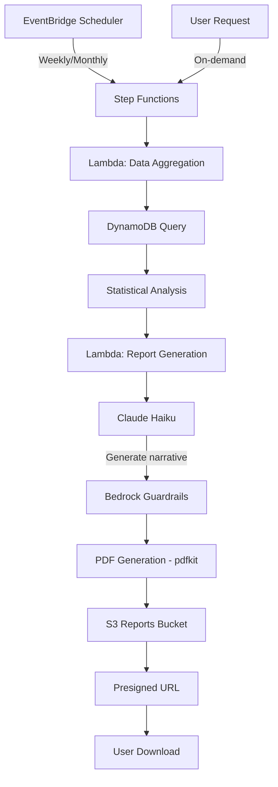

# TicTrack 医療機関向けレポート設計書

> **バージョン**: 1.0
> **最終更新**: 2026-03-10
> **目的**: 医療機関での診察・治療計画に活用できる包括的なレポート設計

---

## 1. レポートの目的と原則

### 1.1 目的

保護者が医療機関（小児神経科、精神科等）を受診する際に、客観的な観察データを提供し、以下をサポートする：

1. **診断の補助**: チック症状の種類・頻度・重症度の客観的記録
2. **治療効果の評価**: 投薬や行動療法の効果測定
3. **トリガーの特定**: 症状悪化の要因（ストレス、生活イベント等）の把握
4. **長期的な経過観察**: 症状の変化パターンの可視化

### 1.2 Non-Diagnostic 原則

**重要**: TicTrack は診断ツールではない。レポートは以下を遵守する：

- ✅ 観察事実の記録（「〜が観察された」）
- ✅ 統計的な傾向の提示（「頻度が増加傾向」）
- ✅ 相関関係の提示（「イベント X の後に症状増加」）
- ❌ 診断名の提示（「トゥレット症候群」等）
- ❌ 因果関係の断定（「X が原因で症状発生」）
- ❌ 治療推奨（「薬 Y を服用すべき」）

すべてのレポートテキストは Bedrock Guardrails でフィルタリングされる。

---

## 2. レポートの種類

### 2.1 週次レポート（Weekly Summary Report）

**頻度**: 毎週月曜日自動生成  
**対象期間**: 過去 7 日間  
**用途**: 短期的な症状変化の把握

#### 2.1.1 含まれる情報

**A. 基本統計**
```
- 記録されたエピソード数: 23 episodes
- 記録日数: 5 days (欠測: 2 days)
- チックの種類:
  - Motor tics: 18 episodes (78%)
  - Vocal tics: 3 episodes (13%)
  - Both: 2 episodes (9%)
```

**B. 重症度分布**
```
- Severity 1 (Mild): 8 episodes (35%)
- Severity 2 (Moderate): 12 episodes (52%)
- Severity 3 (Severe): 3 episodes (13%)
- Average severity: 1.78
```

**C. 時間帯別分析**
```
Morning (6-12):   5 episodes (22%)
Afternoon (12-18): 8 episodes (35%)
Evening (18-22):  10 episodes (43%)
Night (22-6):     0 episodes (0%)

Peak time: 18:00-20:00 (bedtime routine)
```

**D. 最頻出チック**
```
1. Eye blinking: 8 occurrences
2. Head jerking: 5 occurrences
3. Shoulder shrugging: 4 occurrences
4. Throat clearing: 3 occurrences
```

**E. 週次チェックイン情報**
```
Life events: Started new school semester
Caregiver anxiety score: 3/5 (moderate)
Notes: More tics during homework time
```

**F. 代表クリップ**
- 最も頻繁なチック（eye blinking）の動画
- 最も重度なエピソード（severity 3）の動画
- 新規チックの動画（該当する場合）

### 2.2 月次レポート（Monthly Trend Report）

**頻度**: 毎月 1 日自動生成  
**対象期間**: 過去 30 日間  
**用途**: 中期的なトレンド分析

#### 2.2.1 含まれる情報

**A. トレンド分析**
```
Episode frequency trend:
Week 1: 18 episodes
Week 2: 23 episodes (+28%)
Week 3: 20 episodes (-13%)
Week 4: 15 episodes (-25%)

Overall trend: Decreasing (-17% from Week 1 to Week 4)
```

**B. 重症度の変化**
```
Average severity by week:
Week 1: 1.89
Week 2: 2.04 (+8%)
Week 3: 1.85 (-9%)
Week 4: 1.67 (-10%)

Overall trend: Improving
```

**C. チックタイプの変化**
```
Motor tics: 75% → 72% → 70% → 68% (decreasing)
Vocal tics: 15% → 18% → 20% → 22% (increasing)
Both: 10% → 10% → 10% → 10% (stable)
```

**D. 新規チックの出現**
```
Week 2: New tic observed - "Facial grimacing"
Week 3: New tic observed - "Finger tapping"
```

**E. 生活イベントとの相関**
```
Correlation analysis:
- School exam week (Week 2): +28% episodes, +8% severity
- Family vacation (Week 4): -25% episodes, -10% severity
```

### 2.3 治療効果レポート（Treatment Efficacy Report）

**頻度**: オンデマンド（保護者が手動生成）  
**対象期間**: 治療開始前後の比較期間（例: 治療前 4 週間 vs 治療後 4 週間）  
**用途**: 投薬や行動療法の効果測定

#### 2.3.1 含まれる情報

**A. Before/After 比較**
```
Before treatment (4 weeks):
- Average episodes/week: 21.5
- Average severity: 2.1
- Motor tics: 80%
- Vocal tics: 20%

After treatment (4 weeks):
- Average episodes/week: 14.3 (-33%)
- Average severity: 1.6 (-24%)
- Motor tics: 70%
- Vocal tics: 30%

Improvement: Significant reduction in frequency and severity
```

**B. 週ごとの変化グラフ**
```
[グラフ: エピソード数の推移]
Week -4: ████████████████████ 22
Week -3: ███████████████████ 21
Week -2: ██████████████████████ 24
Week -1: ███████████████████ 19
------- Treatment started -------
Week +1: ████████████████ 16
Week +2: ██████████████ 14
Week +3: ████████████ 12
Week +4: ██████████████ 14
```

**C. 副作用の観察**
```
Caregiver anxiety scores:
Before: 3.5/5 (moderate-high)
After: 2.5/5 (moderate)

Notes from check-ins:
- Week +1: "Child seems more tired"
- Week +2: "Tics reduced but still present during stress"
- Week +3: "Noticeable improvement"
```

### 2.4 トリガー分析レポート（Trigger Analysis Report）

**頻度**: オンデマンド  
**対象期間**: 最低 8 週間のデータ推奨  
**用途**: 症状悪化の要因特定

#### 2.4.1 含まれる情報

**A. 時間帯別パターン**
```
High-frequency periods:
1. 18:00-20:00 (bedtime routine): 35% of episodes
2. 15:00-17:00 (after school): 25% of episodes
3. 07:00-09:00 (morning routine): 15% of episodes

Low-frequency periods:
- 22:00-06:00 (sleep): 2% of episodes
- 12:00-14:00 (lunch/rest): 8% of episodes
```

**B. 生活イベントとの相関**
```
Events associated with increased symptoms:
1. School exams: +45% episodes (p < 0.05)
2. Family conflicts: +32% episodes
3. Sleep deprivation: +28% episodes

Events associated with decreased symptoms:
1. Vacation/breaks: -30% episodes
2. Outdoor activities: -18% episodes
3. Relaxation time: -15% episodes
```

**C. 環境要因**
```
Context analysis (from episode notes):
- "During homework": 18 episodes (high stress)
- "Watching TV": 12 episodes (relaxed)
- "Playing with friends": 8 episodes (engaged)
- "Before bedtime": 15 episodes (transition anxiety)
```

**D. 季節性パターン（長期データがある場合）**
```
Seasonal variation:
- Spring: Average 18 episodes/week
- Summer: Average 12 episodes/week (-33%)
- Fall: Average 22 episodes/week (+22%)
- Winter: Average 20 episodes/week (-9%)
```

---

## 3. レポート生成アーキテクチャ

### 3.1 データソース

```
Episodes テーブル
├─ episodeId, childId, occurredAt
├─ recordType (video/quick_log)
├─ labelStatus, confirmedLabel
├─ originalAILabel, feedbackType
└─ context, notes

CheckIns テーブル
├─ checkInId, childId, weekStart
├─ lifeEvents (生活イベント)
├─ caregiverAnxietyScore (1-5)
└─ notes

TicCards テーブル
├─ cardId, childId, label
├─ type (motor/vocal)
└─ severity (1-3)

AILabels テーブル
├─ episodeId, version
├─ suggestedType, suggestedSeverity
└─ transcriptionText
```

### 3.2 生成フロー



### 3.3 統計計算ロジック

#### 3.3.1 欠測データの処理（Missing-Data Tolerant）

```javascript
// 週次レポートの場合
function calculateWeeklyStats(episodes, weekStart, weekEnd) {
  // 記録された日数をカウント
  const recordedDays = new Set(
    episodes.map(e => e.occurredAt.split('T')[0])
  ).size;
  
  // 欠測日数
  const missingDays = 7 - recordedDays;
  
  // 1日あたりの平均エピソード数（記録日のみ）
  const avgPerRecordedDay = episodes.length / recordedDays;
  
  return {
    totalEpisodes: episodes.length,
    recordedDays,
    missingDays,
    avgPerRecordedDay,
    // 欠測を考慮した推定値は提供しない（誤解を避けるため）
    dataCompleteness: (recordedDays / 7 * 100).toFixed(1) + '%'
  };
}
```

#### 3.3.2 トレンド分析

```javascript
function calculateTrend(weeklyData) {
  // 線形回帰で傾向を計算
  const n = weeklyData.length;
  const sumX = weeklyData.reduce((sum, _, i) => sum + i, 0);
  const sumY = weeklyData.reduce((sum, d) => sum + d.count, 0);
  const sumXY = weeklyData.reduce((sum, d, i) => sum + i * d.count, 0);
  const sumX2 = weeklyData.reduce((sum, _, i) => sum + i * i, 0);
  
  const slope = (n * sumXY - sumX * sumY) / (n * sumX2 - sumX * sumX);
  
  return {
    trend: slope > 0.5 ? 'increasing' : slope < -0.5 ? 'decreasing' : 'stable',
    changeRate: ((slope / (sumY / n)) * 100).toFixed(1) + '%'
  };
}
```

#### 3.3.3 相関分析

```javascript
function analyzeCorrelation(episodes, checkIns) {
  const correlations = [];
  
  checkIns.forEach(checkIn => {
    const weekEpisodes = episodes.filter(e => 
      isInWeek(e.occurredAt, checkIn.weekStart)
    );
    
    // 前週との比較
    const prevWeekEpisodes = episodes.filter(e =>
      isInPreviousWeek(e.occurredAt, checkIn.weekStart)
    );
    
    const change = weekEpisodes.length - prevWeekEpisodes.length;
    const changePercent = (change / prevWeekEpisodes.length * 100).toFixed(1);
    
    if (checkIn.lifeEvents && Math.abs(change) > 3) {
      correlations.push({
        event: checkIn.lifeEvents,
        change: changePercent + '%',
        direction: change > 0 ? 'increase' : 'decrease'
      });
    }
  });
  
  return correlations;
}
```

### 3.4 AI によるナラティブ生成

```python
# Lambda Report Generator での Claude Haiku 使用例

REPORT_PROMPT = """
以下のデータに基づいて、医療機関向けの週次レポートのサマリーを生成してください。

【重要な制約】
- 観察事実のみを記述（診断名は使用しない）
- 「〜が観察された」「〜の傾向が見られる」等の表現を使用
- 因果関係ではなく相関関係として記述
- 治療推奨は行わない

【データ】
{statistics_json}

【出力形式】
1. 今週の概要（2-3文）
2. 注目すべき変化（あれば）
3. 生活イベントとの関連（あれば）
"""

def generate_narrative(stats):
    response = bedrock.invoke_model(
        modelId="anthropic.claude-3-haiku-20240307-v1:0",
        body=json.dumps({
            "anthropic_version": "bedrock-2023-05-31",
            "messages": [{
                "role": "user",
                "content": REPORT_PROMPT.format(
                    statistics_json=json.dumps(stats, ensure_ascii=False)
                )
            }],
            "max_tokens": 500,
            "temperature": 0.3
        })
    )
    
    # Guardrails でフィルタリング
    filtered = apply_guardrails(response['content'])
    
    return filtered
```

---

## 4. PDF レポートのレイアウト

### 4.1 週次レポート PDF 構成

```
┌─────────────────────────────────────────┐
│ TicTrack Weekly Report                  │
│ Child: [Name]                           │
│ Period: March 3-9, 2026                 │
│ Generated: March 10, 2026               │
└─────────────────────────────────────────┘

┌─────────────────────────────────────────┐
│ 1. Summary                              │
├─────────────────────────────────────────┤
│ [AI-generated narrative]                │
│                                         │
│ This week, 23 episodes were recorded   │
│ over 5 days. The most frequent tic     │
│ type was motor tics (78%). A notable   │
│ increase in episodes was observed      │
│ during evening hours (18:00-20:00).    │
└─────────────────────────────────────────┘

┌─────────────────────────────────────────┐
│ 2. Episode Statistics                   │
├─────────────────────────────────────────┤
│ Total episodes: 23                      │
│ Recorded days: 5/7 (71.4%)             │
│ Avg per recorded day: 4.6              │
│                                         │
│ Type distribution:                      │
│ ████████████████ Motor: 18 (78%)       │
│ ███ Vocal: 3 (13%)                     │
│ ██ Both: 2 (9%)                        │
│                                         │
│ Severity distribution:                  │
│ ████████ Mild (1): 8 (35%)             │
│ ████████████ Moderate (2): 12 (52%)    │
│ ███ Severe (3): 3 (13%)                │
│ Average: 1.78                          │
└─────────────────────────────────────────┘

┌─────────────────────────────────────────┐
│ 3. Time Pattern Analysis                │
├─────────────────────────────────────────┤
│ [Bar chart: Episodes by hour]          │
│                                         │
│ Peak hours: 18:00-20:00 (10 episodes)  │
│ Context: Bedtime routine               │
└─────────────────────────────────────────┘

┌─────────────────────────────────────────┐
│ 4. Most Frequent Tics                   │
├─────────────────────────────────────────┤
│ 1. Eye blinking: 8 occurrences         │
│ 2. Head jerking: 5 occurrences         │
│ 3. Shoulder shrugging: 4 occurrences   │
│ 4. Throat clearing: 3 occurrences      │
└─────────────────────────────────────────┘

┌─────────────────────────────────────────┐
│ 5. Weekly Check-in                      │
├─────────────────────────────────────────┤
│ Life events: Started new school semester│
│ Caregiver anxiety: 3/5 (moderate)      │
│ Notes: More tics during homework time  │
└─────────────────────────────────────────┘

┌─────────────────────────────────────────┐
│ 6. Representative Clips                 │
├─────────────────────────────────────────┤
│ [Thumbnail] Most frequent tic           │
│ Eye blinking - March 5, 18:30          │
│ Severity: 2 (Moderate)                 │
│ [Secure share link]                    │
│                                         │
│ [Thumbnail] Highest severity episode   │
│ Head jerking - March 7, 19:15          │
│ Severity: 3 (Severe)                   │
│ [Secure share link]                    │
└─────────────────────────────────────────┘

┌─────────────────────────────────────────┐
│ Important Notice                        │
├─────────────────────────────────────────┤
│ This report is based on caregiver      │
│ observations and AI-assisted analysis. │
│ It is not a diagnostic tool and should │
│ be used in conjunction with            │
│ professional medical evaluation.       │
└─────────────────────────────────────────┘
```

### 4.2 月次レポート追加セクション

```
┌─────────────────────────────────────────┐
│ 7. 4-Week Trend Analysis                │
├─────────────────────────────────────────┤
│ [Line chart: Episodes per week]        │
│                                         │
│ Week 1: 18 episodes                    │
│ Week 2: 23 episodes (+28%)             │
│ Week 3: 20 episodes (-13%)             │
│ Week 4: 15 episodes (-25%)             │
│                                         │
│ Overall trend: Decreasing (-17%)       │
└─────────────────────────────────────────┘

┌─────────────────────────────────────────┐
│ 8. Correlation with Life Events         │
├─────────────────────────────────────────┤
│ Week 2: School exam                    │
│   → +28% episodes, +8% severity        │
│                                         │
│ Week 4: Family vacation                │
│   → -25% episodes, -10% severity       │
└─────────────────────────────────────────┘
```

---

## 5. 実装優先順位

### Phase 1: MVP（週次レポート基本版）
- [x] 基本統計（エピソード数、タイプ分布、重症度）
- [x] 時間帯別分析
- [x] 最頻出チック
- [x] 週次チェックイン情報
- [x] 代表クリップ（サムネイル + 共有リンク）
- [x] PDF 生成

### Phase 2: 拡張機能
- [ ] AI ナラティブ生成（Claude Haiku）
- [ ] 月次トレンドレポート
- [ ] グラフ・チャート生成
- [ ] 生活イベントとの相関分析

### Phase 3: 高度な分析
- [ ] 治療効果レポート（Before/After 比較）
- [ ] トリガー分析レポート
- [ ] 季節性パターン分析
- [ ] 統計的有意性検定

---

## 6. 医療機関向けの使い方ガイド

### 6.1 診察時の活用方法

**初診時**:
1. 過去 4 週間の月次レポートを印刷
2. 最頻出チックの代表動画を医師に見せる
3. 生活イベントとの相関を説明

**経過観察時**:
1. 前回診察以降の週次レポートを持参
2. トレンドグラフで変化を説明
3. 新規チックの出現を報告

**治療効果評価時**:
1. 治療効果レポートを生成
2. Before/After の比較データを提示
3. 副作用や気になる変化を報告

### 6.2 レポートの読み方（医療者向け）

**データの信頼性**:
- Data completeness が 70% 以上: 信頼性高
- Data completeness が 50-70%: 参考程度
- Data completeness が 50% 未満: 解釈に注意

**トレンドの解釈**:
- 変化率 ±10% 未満: 有意な変化なし
- 変化率 ±10-30%: 軽度の変化
- 変化率 ±30% 以上: 顕著な変化

**相関分析の注意点**:
- 相関関係 ≠ 因果関係
- 複数の要因が絡む可能性
- 個別の臨床評価が必要

---

## 7. プライバシーとセキュリティ

### 7.1 レポート共有

**セキュア共有リンク**:
- 有効期限: 24/48/72 時間（ユーザー選択）
- トークンベース認証（UUID）
- DynamoDB TTL で自動削除

**動画共有のオプトイン**:
- デフォルト: PDF のみ共有
- ユーザーが明示的に選択した場合のみ動画を含める

### 7.2 データ保持

- レポート PDF: 365 日間保持
- 共有トークン: 最大 72 時間で自動削除
- ユーザーはいつでもレポートを削除可能

---

## 8. 今後の拡張案

### 8.1 機械学習による予測

- 症状悪化の予測（次週のリスク評価）
- パーソナライズされたトリガー特定
- 類似症例との比較（匿名化データ）

### 8.2 多言語対応

- 日本語レポート生成
- 医療用語の適切な翻訳

### 8.3 医療機関連携

- FHIR 形式でのデータエクスポート
- 電子カルテシステムとの統合
- 遠隔診療プラットフォームとの連携

---

## 参考資料

- [Tourette Association of America - Clinical Guidelines](https://tourette.org/)
- [YGTSS (Yale Global Tic Severity Scale)](https://www.ncbi.nlm.nih.gov/pmc/articles/PMC3039839/)
- [CDC - Tourette Syndrome Data and Statistics](https://www.cdc.gov/tourette/)
