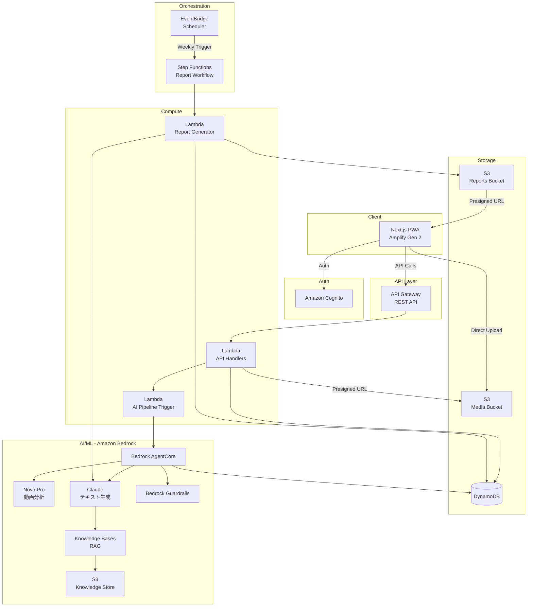
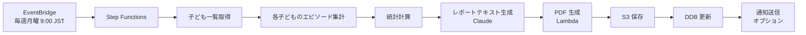

# TicTrack アーキテクチャ設計書 v1

> **ステータス**: 初期ドラフト（レビュー待ち）
> **最終更新**: 2026-02-12
> **対象**: AWS 10,000 AIdeas Competition セミファイナリスト・プロトタイプ

---

## 1. 仮定と制約条件

### 仮定

| # | 仮定 | 根拠 |
|---|------|------|
| A1 | ユーザーはスマートフォンのブラウザ（PWA）からアクセスする | 親が子どものチックを撮影する場面はほぼモバイル |
| A2 | 動画は 10〜20 秒、解像度は 720p 程度で十分 | チックの視認に必要十分な品質 |
| A3 | 1 家庭あたり子ども 1〜3 名を想定 | 一般的な家庭規模 |
| A4 | 週あたりのエピソード記録数は 5〜30 件程度 | パイロット想定 |
| A5 | 英語 UI を基本とし、日本語は将来対応 | コンペ提出物として英語優先 |
| A6 | Amazon Nova Pro は動画を直接入力可能 | Bedrock のマルチモーダル API 仕様に基づく |
| A7 | プロトタイプではシングルリージョン（us-east-1）で運用 | レイテンシーよりコスト最適化を優先 |

### 制約条件

| # | 制約 | 影響 |
|---|------|------|
| C1 | **AWS Free Tier** で運用（Bedrock 除く） | サービス選定・使用量に直接影響 |
| C2 | **29 日間**の開発期間（〜2026/3/13） | MVP スコープの厳格な絞り込みが必要 |
| C3 | **Kiro 必須**（開発の一部で使用） | Spec-driven 開発ワークフローの採用 |
| C4 | **コンペ用プロトタイプ**（本番運用ではない） | スケーラビリティ・可用性は最低限で可 |
| C5 | **個人開発**（1 名） | 並列作業不可、自動化・コード生成を最大活用 |
| C6 | **Non-diagnostic** 制約 | Guardrails による出力制御が必須 |
| C7 | Bedrock は Free Tier 対象外 | 月額 $12〜15 程度のコストを許容する前提 |

---

## 2. システム概観

### 2.1 コンポーネント図



### 2.2 データフロー概要

```
[親がチックを記録]
  ├─ 新規/不明 → ワンタップ動画撮影 → S3 アップロード → AI ラベリングパイプライン
  └─ 既出チック → チックカード選択 → ワンタップ記録 → DynamoDB 直接保存

[AI ラベリングパイプライン]
  動画 → Nova Pro 分析 → 構造化 JSON → 既出チック照合 → ラベル提案 → 親が確認/修正

[週次レポート生成]
  EventBridge (毎週) → Step Functions → エピソード集計 → 統計計算 → PDF 生成 → S3 保存 → 通知

[マイクロガイド]
  親の質問/状況 → Knowledge Bases (RAG) → Guardrails → ガイダンス表示
```

---

## 3. フロントエンド設計

### 3.1 技術スタック

| 項目 | 選択 | 理由 |
|------|------|------|
| フレームワーク | Next.js 14+ (App Router) | Amplify Gen 2 との統合、SSR/SSG 対応 |
| ホスティング | AWS Amplify Gen 2 | Free Tier、CI/CD 統合、Cognito 連携 |
| PWA | next-pwa | オフライン対応、ホーム画面追加、カメラアクセス |
| UI ライブラリ | Tailwind CSS + shadcn/ui | 迅速な開発、レスポンシブ対応 |
| 状態管理 | React Context + SWR | シンプル、プロトタイプに十分 |
| 動画撮影 | MediaRecorder API | ブラウザネイティブ、追加ライブラリ不要 |

### 3.2 ページ構成

| ページ | パス | 機能 |
|--------|------|------|
| ログイン/サインアップ | `/auth` | Cognito Hosted UI or Amplify UI Components |
| ダッシュボード/タイムライン | `/` | エピソード一覧（日別）、直近の統計サマリー |
| 動画キャプチャ | `/capture` | ワンタップ録画開始/停止、プレビュー、アップロード |
| チックカード管理 | `/tic-cards` | チックカードの一覧・追加・編集・削除 |
| エピソード詳細 | `/episodes/[id]` | AI ラベル表示、確認/修正 UI、動画再生 |
| 週次レポート閲覧 | `/reports` | レポート一覧、PDF ビューワー、共有リンク生成 |
| マイクロガイド | `/guides` | カテゴリ別ガイド一覧、RAG ベースの質問応答 |
| 設定 | `/settings` | プロフィール、子ども管理、データ保持設定、通知 |

### 3.3 動画キャプチャ UX フロー

```
1. 「記録」ボタンタップ
2. 選択: [新規/不明 → 動画撮影] or [既出チック → チックカード選択]
3. (動画の場合) カメラ起動 → 録画（10〜20秒、カウントダウン表示）
4. プレビュー → 「保存」で S3 アップロード開始
5. バックグラウンドで AI ラベリング実行
6. 完了通知 → ラベル確認/修正画面へ遷移
```

---

## 4. API 設計

### 4.1 基盤

- **Amazon API Gateway** (REST API)
- **AWS Lambda** (Node.js 20 ランタイム)
- 認証: Cognito User Pool Authorizer
- レスポンス形式: JSON

### 4.2 エンドポイント一覧

#### 認証（Cognito 直接連携）

Amplify Auth ライブラリが Cognito と直接通信するため、カスタム API 不要。

#### 子どもプロフィール

| メソッド | パス | 説明 |
|----------|------|------|
| GET | `/children` | ログインユーザーの子ども一覧取得 |
| POST | `/children` | 子ども追加 |
| PUT | `/children/{childId}` | 子ども情報更新 |
| DELETE | `/children/{childId}` | 子ども削除 |

#### チックカード

| メソッド | パス | 説明 |
|----------|------|------|
| GET | `/children/{childId}/tic-cards` | 子どものチックカード一覧 |
| POST | `/children/{childId}/tic-cards` | チックカード作成 |
| PUT | `/children/{childId}/tic-cards/{cardId}` | チックカード更新 |
| DELETE | `/children/{childId}/tic-cards/{cardId}` | チックカード削除 |

#### エピソード

| メソッド | パス | 説明 |
|----------|------|------|
| GET | `/children/{childId}/episodes?from=&to=` | 期間指定でエピソード一覧 |
| POST | `/children/{childId}/episodes` | エピソード作成（チックカード記録 or 動画記録） |
| GET | `/children/{childId}/episodes/{episodeId}` | エピソード詳細 |
| PUT | `/children/{childId}/episodes/{episodeId}` | エピソード更新（ラベル確認/修正） |
| DELETE | `/children/{childId}/episodes/{episodeId}` | エピソード削除 |

#### 動画アップロード

| メソッド | パス | 説明 |
|----------|------|------|
| POST | `/children/{childId}/episodes/{episodeId}/upload-url` | S3 presigned URL 発行 |

#### AI ラベリング

| メソッド | パス | 説明 |
|----------|------|------|
| POST | `/children/{childId}/episodes/{episodeId}/analyze` | AI 分析トリガー（非同期） |
| GET | `/children/{childId}/episodes/{episodeId}/ai-labels` | AI ラベル結果取得 |

#### レポート

| メソッド | パス | 説明 |
|----------|------|------|
| GET | `/children/{childId}/reports` | レポート一覧 |
| GET | `/children/{childId}/reports/{reportId}` | レポート詳細 + PDF ダウンロード URL |
| POST | `/children/{childId}/reports/generate` | 手動レポート生成トリガー |

#### マイクロガイド

| メソッド | パス | 説明 |
|----------|------|------|
| GET | `/guides?category=` | カテゴリ別ガイド一覧 |
| POST | `/guides/ask` | RAG ベースの質問応答 |

---

## 5. データモデル

### 5.1 設計方針

**マルチテーブル設計**を採用する。理由:

- プロトタイプ段階ではシンプルさ・可読性を優先
- エンティティ間のアクセスパターンが比較的独立
- 29 日間の開発期間でシングルテーブル設計のオーバーヘッドは不要
- 将来的にシングルテーブルへの移行も可能

### 5.2 テーブル設計

#### Users テーブル

| 属性 | 型 | 説明 |
|------|-----|------|
| PK: `userId` | String | Cognito sub |
| `email` | String | メールアドレス |
| `displayName` | String | 表示名 |
| `settings` | Map | アプリ設定（通知、データ保持期間等） |
| `createdAt` | String (ISO 8601) | 作成日時 |
| `updatedAt` | String (ISO 8601) | 更新日時 |

#### Children テーブル

| 属性 | 型 | 説明 |
|------|-----|------|
| PK: `childId` | String (ULID) | 子ども ID |
| `userId` | String | 親ユーザー ID |
| `displayName` | String | 表示名（ニックネーム等） |
| `birthYearMonth` | String | 生年月（YYYY-MM）、年齢の大まかな目安用 |
| `createdAt` | String (ISO 8601) | 作成日時 |
| `updatedAt` | String (ISO 8601) | 更新日時 |

- **GSI: `userId-index`** — PK: `userId`, SK: `createdAt`（ユーザー単位で子ども一覧取得）

#### TicCards テーブル

| 属性 | 型 | 説明 |
|------|-----|------|
| PK: `cardId` | String (ULID) | チックカード ID |
| `childId` | String | 子ども ID |
| `label` | String | 表示名（例: 「首振り」「咳払い」） |
| `type` | String | `motor` / `vocal` |
| `description` | String | 詳細説明（任意） |
| `severity` | Number | デフォルト重さ (1-3) |
| `isActive` | Boolean | 有効/無効 |
| `createdAt` | String (ISO 8601) | 作成日時 |
| `updatedAt` | String (ISO 8601) | 更新日時 |

- **GSI: `childId-index`** — PK: `childId`, SK: `createdAt`（子ども単位でチックカード一覧取得）

#### Episodes テーブル

| 属性 | 型 | 説明 |
|------|-----|------|
| PK: `episodeId` | String (ULID) | エピソード ID |
| `childId` | String | 子ども ID |
| `recordType` | String | `video` / `quick_log` |
| `ticCardId` | String (optional) | 既出チック記録の場合のカード ID |
| `occurredAt` | String (ISO 8601) | 発生日時 |
| `context` | String | 状況（就寝前、宿題中、登校前等） |
| `duration` | Number | 動画の長さ（秒） |
| `notes` | String | メモ（任意） |
| `labelStatus` | String | `pending` / `ai_suggested` / `confirmed` / `edited` |
| `confirmedLabel` | Map | 確定ラベル（type, severity, context, ticCardId） |
| `createdAt` | String (ISO 8601) | 作成日時 |
| `updatedAt` | String (ISO 8601) | 更新日時 |

- **GSI: `childId-occurredAt-index`** — PK: `childId`, SK: `occurredAt`（日付範囲検索）
- **GSI: `childId-labelStatus-index`** — PK: `childId`, SK: `labelStatus`（未確認ラベルのフィルタ）

#### VideoMetadata テーブル

| 属性 | 型 | 説明 |
|------|-----|------|
| PK: `episodeId` | String | エピソード ID（1:1 対応） |
| `s3Key` | String | S3 オブジェクトキー |
| `s3Bucket` | String | S3 バケット名 |
| `mimeType` | String | `video/mp4` 等 |
| `fileSize` | Number | ファイルサイズ（bytes） |
| `uploadStatus` | String | `pending` / `uploading` / `completed` / `failed` |
| `thumbnailS3Key` | String | サムネイル S3 キー |
| `createdAt` | String (ISO 8601) | 作成日時 |

#### AILabels テーブル

| 属性 | 型 | 説明 |
|------|-----|------|
| PK: `episodeId` | String | エピソード ID |
| SK: `version` | Number | ラベルバージョン（再分析対応） |
| `modelId` | String | 使用モデル ID |
| `rawOutput` | String (JSON) | モデルの生出力 |
| `suggestedType` | String | `motor` / `vocal` / `both` |
| `suggestedSeverity` | Number | 1-3 |
| `suggestedContext` | String | 推定状況 |
| `matchedTicCardId` | String (optional) | 一致候補のチックカード ID |
| `matchConfidence` | Number | 一致信頼度 (0-1) |
| `isNewTic` | Boolean | 新規チックの可能性 |
| `guardrailApplied` | Boolean | Guardrails が介入したか |
| `processingTimeMs` | Number | 処理時間 |
| `createdAt` | String (ISO 8601) | 作成日時 |

#### WeeklyReports テーブル

| 属性 | 型 | 説明 |
|------|-----|------|
| PK: `reportId` | String (ULID) | レポート ID |
| `childId` | String | 子ども ID |
| `weekStart` | String (ISO 8601) | 週の開始日 |
| `weekEnd` | String (ISO 8601) | 週の終了日 |
| `status` | String | `generating` / `completed` / `failed` |
| `pdfS3Key` | String | PDF の S3 キー |
| `stats` | Map | 統計サマリー（JSON） |
| `episodeCount` | Number | 対象エピソード数 |
| `representativeEpisodeIds` | List | 代表エピソード ID リスト |
| `createdAt` | String (ISO 8601) | 作成日時 |

- **GSI: `childId-weekStart-index`** — PK: `childId`, SK: `weekStart`（子ども×週でレポート検索）

### 5.3 アクセスパターンまとめ

| パターン | テーブル | キー / GSI |
|----------|---------|------------|
| ユーザーの子ども一覧 | Children | GSI: `userId-index` |
| 子どものチックカード一覧 | TicCards | GSI: `childId-index` |
| 子どものエピソード（日付範囲） | Episodes | GSI: `childId-occurredAt-index` |
| 未確認ラベルのエピソード | Episodes | GSI: `childId-labelStatus-index` |
| エピソードの AI ラベル | AILabels | PK: `episodeId` |
| エピソードの動画メタデータ | VideoMetadata | PK: `episodeId` |
| 子どもの週次レポート | WeeklyReports | GSI: `childId-weekStart-index` |

---

## 6. メディアパイプライン

### 6.1 S3 バケット構成

```
tictrack-media-{env}/
├── videos/
│   └── {userId}/{childId}/{episodeId}/
│       ├── original.mp4          # アップロード原本
│       └── thumbnail.jpg         # サムネイル（Lambda で生成）
├── reports/
│   └── {userId}/{childId}/{reportId}/
│       └── weekly_report.pdf     # 週次レポート PDF
└── knowledge/
    └── micro-guides/             # RAG 用ナレッジソース
        ├── supportive_communication.md
        ├── environment_adjustment.md
        └── ...
```

### 6.2 アップロードフロー

```
1. クライアント → POST /episodes/{episodeId}/upload-url
2. Lambda → S3 presigned URL 生成（PUT、Content-Type 制限、5 分有効）
3. クライアント → S3 に直接 PUT（presigned URL 使用）
4. S3 Event Notification → Lambda (AI パイプライントリガー)
   ※ または、クライアントがアップロード完了後に POST /analyze を呼ぶ
```

### 6.3 セキュリティ

| 項目 | 設定 |
|------|------|
| 暗号化 | SSE-S3（デフォルト暗号化） |
| アクセス制御 | Presigned URL のみ（バケットはパブリックアクセス完全ブロック） |
| CORS | フロントエンドドメインのみ許可 |
| バケットポリシー | Lambda ロール、Cognito Identity Pool のみ許可 |

### 6.4 ライフサイクルポリシー

| ルール | 対象 | 日数 | アクション |
|--------|------|------|----------|
| 動画の自動アーカイブ | `videos/` | 90 日 | S3 Glacier に移行 |
| 一時ファイルの削除 | `tmp/` | 1 日 | 削除 |

※ ユーザー設定によるデータ保持期間の短縮はアプリレベルで制御（削除 API 実装）

---

## 7. AI/ML パイプライン

### 7.1 動画分析（Amazon Nova Pro）

#### 入力

- 10〜20 秒の動画ファイル（S3 URI）
- 子どもの既出チックカード一覧（コンテキスト情報として）

#### プロンプト構造（概要）

```
あなたはチック症状の観察アシスタントです。以下の動画を分析し、構造化JSONで結果を返してください。

【重要な制約】
- 診断は行わないでください
- 治療助言は行わないでください
- 因果関係の断定は行わないでください
- 「可能性がある」「〜のように見える」といった表現を使用してください

【既出チックカード】
{ticCards JSON}

【出力フォーマット】
{
  "observations": [
    {
      "timestamp_sec": <number>,
      "type": "motor" | "vocal" | "both",
      "severity": 1 | 2 | 3,
      "description": "<観察された動作/音声の客観的記述>",
      "context_clues": "<背景状況の手がかり>",
      "matched_tic_card_id": "<一致候補の cardId or null>",
      "match_confidence": <0.0-1.0>,
      "is_possibly_new": <boolean>
    }
  ],
  "overall_summary": "<全体の要約>",
  "observation_quality": "clear" | "partially_obscured" | "unclear"
}
```

#### 出力処理

1. Nova Pro の生出力を JSON パース
2. Guardrails でフィルタリング（診断的表現の除去）
3. 既出チック照合ロジックを実行
4. `AILabels` テーブルに保存
5. `Episodes` テーブルの `labelStatus` を `ai_suggested` に更新

### 7.2 既出チック照合アルゴリズム

#### アプローチ: LLM ベース比較（Phase 1）

プロトタイプでは、Nova Pro の出力記述と既存チックカードの記述を LLM（Claude）に比較させるシンプルなアプローチを採用:

```
【タスク】
以下の新しい観察と既存のチックカードを比較し、一致する可能性があるものを特定してください。

【新しい観察】
{observation description from Nova Pro}

【既存チックカード】
{list of tic cards with labels and descriptions}

【出力】
{
  "best_match": { "cardId": "...", "confidence": 0.85, "reasoning": "..." },
  "alternative_matches": [...],
  "is_likely_new": false
}
```

#### 将来的な拡張候補

- テキスト埋め込み（Titan Embeddings）によるコサイン類似度計算
- チックカードの特徴ベクトルキャッシュ
- ユーザーフィードバックによる照合精度の継続的改善

### 7.3 Bedrock AgentCore オーケストレーション

#### エージェント構成

```
TicTrack Labeling Agent
├── Tool 1: VideoAnalyzer
│   └── Nova Pro を呼び出し、動画から構造化観察データを抽出
├── Tool 2: TicCardMatcher
│   └── 既出チックカードとの照合を実行
├── Tool 3: LabelFormatter
│   └── 結果を親向けの提案ラベルにフォーマット
└── Guardrails: NonDiagnosticFilter
    └── すべての出力に適用
```

#### ワークフロー

```
1. トリガー: 動画アップロード完了 or POST /analyze
2. AgentCore が VideoAnalyzer ツールを呼び出し
3. 結果を TicCardMatcher に渡す
4. LabelFormatter で親向けの表示形式に整形
5. Guardrails で最終フィルタリング
6. 結果を DynamoDB に保存
7. (オプション) プッシュ通知で親に通知
```

#### AgentCore vs Step Functions の使い分け

| 用途 | 採用サービス | 理由 |
|------|-------------|------|
| AI ラベリングパイプライン | AgentCore | LLM のツール呼び出し、動的判断が必要 |
| 週次レポート生成 | Step Functions | 定型的なワークフロー、スケジュール実行 |
| マイクロガイド生成 | Knowledge Bases (直接) | 単発の RAG クエリ、オーケストレーション不要 |

### 7.4 Guardrails 設定

#### 目的

**Non-diagnostic** 制約を技術的に担保する。

#### フィルタリングルール

| カテゴリ | ブロック対象 | 例 |
|----------|-------------|-----|
| 診断 | 疾患名の断定、診断的結論 | 「トゥレット症候群です」→ ブロック |
| 治療助言 | 投薬、治療法の推奨 | 「薬物療法を検討すべき」→ ブロック |
| 因果断定 | 原因の特定・断定 | 「ストレスが原因です」→ ブロック |
| 予後予測 | 症状の将来予測 | 「悪化するでしょう」→ ブロック |

#### 許可する表現

- 「〜のように観察されます」
- 「〜の可能性があります」
- 「詳しくは医療専門家にご相談ください」
- 客観的な頻度・パターンの記述

#### 実装

```
Bedrock Guardrails:
  - Content filters: 上記カテゴリを BLOCK
  - Denied topics: diagnosis, treatment_advice, causal_claims, prognosis
  - Word filters: 特定の断定的表現のブロックリスト
  - Contextual grounding: RAG 出力に対するソース一致チェック
```

### 7.5 RAG マイクロガイド

#### ナレッジソース

- 信頼できる医療機関・公的機関の資料（キュレーション済み）
- 支援的コミュニケーションのガイドライン
- 家庭環境の調整に関する情報
- 受診準備チェックリスト

#### アーキテクチャ

```
Knowledge Bases (Amazon Bedrock)
├── Data Source: S3 バケット (knowledge/ プレフィックス)
├── Vector Store: S3 Vectors (コスト優先)
├── Embedding Model: Amazon Titan Embeddings V2
├── Chunking: Fixed-size (512 tokens, 20% overlap)
└── Retrieval: Top-K=3, Score threshold=0.7
```

#### クエリフロー

```
1. 親の質問 or 状況コンテキスト
2. Knowledge Bases API で関連チャンクを検索
3. Claude に検索結果 + 質問を入力
4. Guardrails で出力フィルタリング
5. ソース情報（引用元）と共に表示
```

---

## 8. レポート生成

### 8.1 オーケストレーション



### 8.2 統計アプローチ（Missing-Data Tolerant）

#### 基本方針

- **全件カウントを前提にしない**: 「記録された範囲での傾向」として提示
- **明示的な欠測表記**: 「今週の記録日数: 5/7 日」
- **変化に焦点**: 絶対数よりも前週比・トレンドを重視

#### 統計項目

| 項目 | 計算方法 | 表示形式 |
|------|----------|---------|
| 記録概要 | 今週のエピソード数、記録日数/7 | 「5日間で12回の記録」 |
| 前週比変化 | (今週 - 先週) / 先週 × 100 | 「先週と比べて +20%」（記録日数で正規化） |
| 重さの分布 | severity 1/2/3 の割合 | 円グラフ or 棒グラフ |
| 時間帯分布 | 朝/昼/夕/夜 の発生記録数 | ヒートマップ |
| 状況別分布 | context 別の発生記録数 | 棒グラフ |
| 時間帯 × 状況 | クロス集計 | ヒートマップ |
| チックタイプ別 | motor/vocal/both の割合 | 棒グラフ |
| 代表エピソード | severity が最高、または典型的なもの 1〜3 件 | 動画サムネイル + 要約 |

#### 欠測への対応

```
【レポート内の注記例】
「このレポートは、今週記録された観察に基づいています。
 記録されていない時間帯にも症状が発生している可能性があります。
 傾向の解釈は、医療専門家とご相談ください。」
```

### 8.3 PDF 生成

- **ライブラリ候補**: `@react-pdf/renderer` or `pdfkit`（Lambda レイヤー）
- **構成**: ヘッダー（子ども情報、期間）→ 統計サマリー → グラフ → 代表エピソード → 免責事項
- **出力先**: S3 reports プレフィックス
- **サイズ目安**: 2〜4 ページ

---

## 9. セキュリティ・プライバシー

### 9.1 認証・認可

| 項目 | 実装 |
|------|------|
| 認証 | Amazon Cognito User Pool（メール/パスワード） |
| トークン | JWT（ID Token + Access Token） |
| API 認可 | API Gateway Cognito Authorizer |
| セッション管理 | Amplify Auth ライブラリ（自動トークンリフレッシュ） |

### 9.2 データ保護

| 対象 | 方式 |
|------|------|
| S3（動画、レポート） | SSE-S3（サーバーサイド暗号化） |
| DynamoDB | 暗号化（デフォルト有効） |
| 通信 | HTTPS のみ（API Gateway, CloudFront） |
| Presigned URL | 有効期限: 5 分（アップロード）、60 分（閲覧） |

### 9.3 プライバシー原則

| 原則 | 実装 |
|------|------|
| 最小限のデータ収集 | 必要最小限のメタデータのみ保存 |
| ユーザー制御のデータ保持 | 設定画面でデータ保持期間を選択可能 |
| ユーザー制御の共有 | レポート共有は明示的なオプトイン |
| PII の保護 | ログに PII を含めない、動画は暗号化保存 |
| データ削除 | アカウント削除時にすべてのデータを削除 |
| 子どものプライバシー | 生年月日ではなく生年月のみ保存、本名不要 |

---

## 10. AWS Free Tier 予算見積もり

### 10.1 Free Tier 内サービス

| サービス | Free Tier 枠 | 想定使用量 | 月額コスト |
|----------|-------------|-----------|-----------|
| **Amplify Hosting** | 1,000 ビルド分/月、15 GB 配信 | 少量 | $0 |
| **Cognito** | 50,000 MAU | 〜10 ユーザー | $0 |
| **API Gateway** | 100 万リクエスト/月 | 〜10,000 リクエスト | $0 |
| **Lambda** | 100 万リクエスト + 40 万 GB-秒/月 | 〜50,000 リクエスト | $0 |
| **DynamoDB** | 25 GB ストレージ, 25 WCU/25 RCU | 〜1 GB | $0 |
| **S3** | 5 GB ストレージ、20,000 GET、2,000 PUT | 〜3 GB | $0 |
| **EventBridge** | 無料（デフォルトバスは無料） | 週 1 回 | $0 |
| **Step Functions** | 4,000 状態遷移/月 | 〜100 遷移 | $0 |

### 10.2 Free Tier 外サービス

| サービス | 用途 | 想定使用量 | 月額コスト（概算） |
|----------|------|-----------|-------------------|
| **Bedrock - Nova Pro** | 動画分析 | 〜100 動画/月 | ~$5-8 |
| **Bedrock - Claude (Haiku)** | テキスト生成、照合 | 〜200 リクエスト/月 | ~$2-3 |
| **Bedrock - Titan Embeddings** | RAG 用埋め込み | 〜50 リクエスト/月 | ~$0.5 |
| **Bedrock - Knowledge Bases** | RAG インフラ | S3 Vectors 使用 | ~$0-1 |
| **Bedrock - Guardrails** | 出力フィルタリング | 〜300 リクエスト/月 | ~$1-2 |

### 10.3 月額合計見積もり

| カテゴリ | コスト |
|----------|--------|
| Free Tier 内 | $0 |
| Bedrock 関連 | **~$10-15** |
| **合計** | **~$10-15/月** |

> **注意**: 上記はプロトタイプ（少数ユーザー、限定的使用）の見積もり。コンペ期間中（2 ヶ月程度）の総コストは ~$20-30 を想定。

---

## 11. Kiro 開発アプローチ

### 11.1 Spec-driven 開発ワークフロー

```
1. Requirements (要件定義)
   └── Kiro Requirements Docs: ユーザーストーリー、受け入れ条件
2. Design (設計)
   └── Kiro Design Docs: API 仕様、データモデル、コンポーネント設計
3. Implementation (実装)
   └── Kiro Hooks: コード変更時に自動テスト実行
```

### 11.2 Kiro 活用計画

| フェーズ | Kiro の活用 |
|----------|------------|
| Phase 1 (MVP) | 要件定義 → 動画キャプチャ、チックカード、AI ラベリングの spec |
| Phase 2 | 週次レポートの spec → テスト駆動で統計ロジック実装 |
| Phase 3 | マイクロガイドの spec → RAG パイプライン実装 |

### 11.3 Hooks 設定（想定）

```
Kiro Hooks:
  on_file_change:
    - pattern: "src/**/*.ts"
      action: "npm run test -- --related"
    - pattern: "src/api/**/*.ts"
      action: "npm run test:api"
  on_spec_change:
    - pattern: "specs/**/*.md"
      action: "npm run generate:types"
```

### 11.4 テスト戦略

| レイヤー | テスト対象 | ツール |
|----------|-----------|--------|
| ユニット | Lambda ハンドラ、統計計算ロジック | Vitest |
| 統合 | API エンドポイント、DynamoDB 操作 | Vitest + aws-sdk-mock |
| E2E | 主要ユーザーフロー | Playwright |
| Guardrails | Non-diagnostic 制約のテスト | カスタムテストスイート |

---

## 付録: 開発優先順位

### Sprint 計画（29 日間）

| 期間 | 対象 | 主要成果物 |
|------|------|-----------|
| Week 1 (2/12-2/18) | 基盤構築 | Amplify + Cognito + DynamoDB + API Gateway セットアップ |
| Week 2 (2/19-2/25) | Phase 1 MVP | 動画キャプチャ、チックカード、エピソード CRUD |
| Week 3 (2/26-3/4) | AI パイプライン | Bedrock 統合、AI ラベリング、Guardrails |
| Week 4 (3/5-3/13) | レポート + 仕上げ | 週次レポート、マイクロガイド、Builder Center 記事 |
