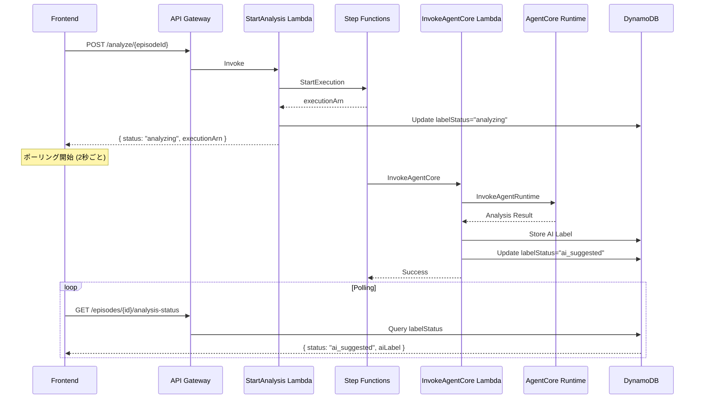
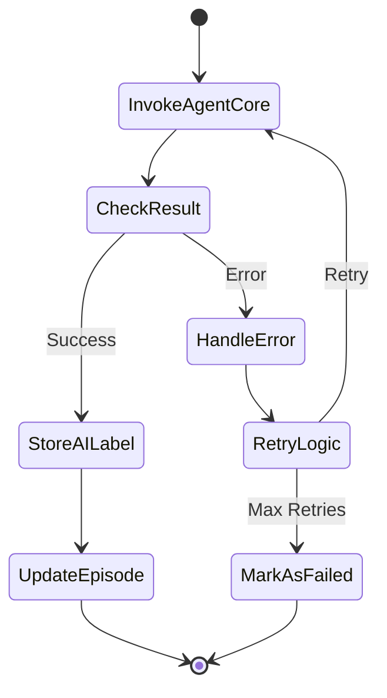

# Step Functions を用いた AI ラベリングワークフロー設計

## 概要

AI 分析処理を非同期化し、API Gateway のタイムアウト（29秒）制限を回避するため、AWS Step Functions を使ったワークフロー管理を実装する。

### 背景

**現状の問題：**
- AgentCore Runtime での AI 分析には時間がかかる（Nova Pro ビデオ分析 + Transcribe + 統合処理）
- 同期的に結果を待つと API Gateway が 504 Gateway Timeout エラーになる
- ユーザーは分析結果を確認できない

**解決策：**
- Step Functions で AI 分析ワークフローを orchestrate
- フロントエンドがポーリングで状態を確認
- エラーハンドリング、リトライ、タイムアウト設定を統一管理

---

## アーキテクチャ

### 全体フロー



### Step Functions ワークフロー定義



---

## Step Functions 定義（Amazon States Language）

```json
{
  "Comment": "AI Labeling Workflow for Tic Episodes",
  "StartAt": "InvokeAgentCore",
  "States": {
    "InvokeAgentCore": {
      "Type": "Task",
      "Resource": "arn:aws:states:::lambda:invoke",
      "Parameters": {
        "FunctionName": "${InvokeAgentCoreLambdaArn}",
        "Payload": {
          "episodeId.$": "$.episodeId",
          "childId.$": "$.childId",
          "s3Key.$": "$.s3Key",
          "bucketName.$": "$.bucketName",
          "videoMimeType.$": "$.videoMimeType"
        }
      },
      "Retry": [
        {
          "ErrorEquals": [
            "States.TaskFailed",
            "Lambda.ServiceException",
            "Lambda.TooManyRequestsException"
          ],
          "IntervalSeconds": 10,
          "MaxAttempts": 3,
          "BackoffRate": 2.0
        }
      ],
      "Catch": [
        {
          "ErrorEquals": ["States.ALL"],
          "ResultPath": "$.error",
          "Next": "MarkAsFailed"
        }
      ],
      "ResultPath": "$.agentResult",
      "Next": "StoreAILabel"
    },
    "StoreAILabel": {
      "Type": "Task",
      "Resource": "arn:aws:states:::dynamodb:putItem",
      "Parameters": {
        "TableName": "${AILabelsTable}",
        "Item": {
          "episodeId": { "S.$": "$.episodeId" },
          "version": { "N": "1" },
          "modelId": { "S": "amazon.nova-pro-v1:0" },
          "rawOutput": { "S.$": "States.JsonToString($.agentResult.Payload.label)" },
          "suggestedType": { "S.$": "$.agentResult.Payload.label.suggestedType" },
          "suggestedSeverity": { "N.$": "States.Format('{}', $.agentResult.Payload.label.suggestedSeverity)" },
          "confidence": { "N.$": "States.Format('{}', $.agentResult.Payload.label.confidence)" },
          "createdAt": { "S.$": "$$.State.EnteredTime" }
        }
      },
      "ResultPath": "$.storeResult",
      "Next": "UpdateEpisode"
    },
    "UpdateEpisode": {
      "Type": "Task",
      "Resource": "arn:aws:states:::dynamodb:updateItem",
      "Parameters": {
        "TableName": "${EpisodesTable}",
        "Key": {
          "episodeId": { "S.$": "$.episodeId" }
        },
        "UpdateExpression": "SET labelStatus = :status, updatedAt = :updatedAt",
        "ExpressionAttributeValues": {
          ":status": { "S": "ai_suggested" },
          ":updatedAt": { "S.$": "$$.State.EnteredTime" }
        }
      },
      "End": true
    },
    "MarkAsFailed": {
      "Type": "Task",
      "Resource": "arn:aws:states:::dynamodb:updateItem",
      "Parameters": {
        "TableName": "${EpisodesTable}",
        "Key": {
          "episodeId": { "S.$": "$.episodeId" }
        },
        "UpdateExpression": "SET labelStatus = :status, updatedAt = :updatedAt",
        "ExpressionAttributeValues": {
          ":status": { "S": "failed" },
          ":updatedAt": { "S.$": "$$.State.EnteredTime" }
        }
      },
      "End": true
    }
  }
}
```

---

## API 仕様

### POST /analyze/{episodeId}

**Request:**
```json
{
  "childId": "child-123",
  "s3Key": "videos/child-123/episode-456.webm",
  "bucketName": "tictrack-media-dev",
  "videoMimeType": "video/webm"
}
```

**Response (即座に返す):**
```json
{
  "episodeId": "episode-456",
  "status": "analyzing",
  "executionArn": "arn:aws:states:ap-northeast-1:123456789012:execution:AILabelingWorkflow:episode-456-timestamp"
}
```

### GET /children/{childId}/episodes/{episodeId}/analysis-status

**Response (分析中):**
```json
{
  "episodeId": "episode-456",
  "status": "analyzing",
  "executionArn": "arn:aws:states:...",
  "startedAt": "2026-03-08T16:00:00Z"
}
```

**Response (完了):**
```json
{
  "episodeId": "episode-456",
  "status": "ai_suggested",
  "aiLabel": {
    "episodeId": "episode-456",
    "version": 1,
    "suggestedType": "motor",
    "suggestedSeverity": 2,
    "confidence": 0.85,
    "observations": [...]
  },
  "completedAt": "2026-03-08T16:01:30Z"
}
```

**Response (失敗):**
```json
{
  "episodeId": "episode-456",
  "status": "failed",
  "error": "AgentCore invocation failed after 3 retries",
  "failedAt": "2026-03-08T16:02:00Z"
}
```

---

## Lambda 関数設計

### 1. StartAnalysis Lambda (POST /analyze/{episodeId})

**役割:**
- Step Functions の実行を開始
- Episodes テーブルの `labelStatus` を `"analyzing"` に更新
- `executionArn` を即座に返す

**実装:**
```typescript
import { SFNClient, StartExecutionCommand } from "@aws-sdk/client-sfn";

const sfnClient = new SFNClient({ region: process.env.AWS_REGION });

export const handler = async (event) => {
  const episodeId = event.pathParameters.episodeId;
  const body = JSON.parse(event.body);

  // Step Functions を起動
  const executionName = `${episodeId}-${Date.now()}`;
  const execution = await sfnClient.send(new StartExecutionCommand({
    stateMachineArn: process.env.STATE_MACHINE_ARN,
    name: executionName,
    input: JSON.stringify({
      episodeId,
      childId: body.childId,
      s3Key: body.s3Key,
      bucketName: body.bucketName,
      videoMimeType: body.videoMimeType,
    }),
  }));

  // Episodes を更新
  await docClient.send(new UpdateCommand({
    TableName: process.env.EPISODES_TABLE,
    Key: { episodeId },
    UpdateExpression: "SET labelStatus = :status, executionArn = :arn, updatedAt = :updatedAt",
    ExpressionAttributeValues: {
      ":status": "analyzing",
      ":arn": execution.executionArn,
      ":updatedAt": new Date().toISOString(),
    },
  }));

  return {
    statusCode: 202, // Accepted
    headers: { "Access-Control-Allow-Origin": "*" },
    body: JSON.stringify({
      episodeId,
      status: "analyzing",
      executionArn: execution.executionArn,
    }),
  };
};
```

### 2. InvokeAgentCore Lambda (Step Functions から呼び出し)

**役割:**
- AgentCore Runtime を呼び出し
- 結果を返す（Step Functions が DynamoDB に保存）

**実装:**
- 既存の `agentcore-proxy` Lambda を再利用
- または新規に作成（Step Functions 専用）

### 3. GetAnalysisStatus Lambda (GET /episodes/{id}/analysis-status)

**役割:**
- Episodes テーブルから `labelStatus` と `executionArn` を取得
- `labelStatus === "ai_suggested"` なら AI ラベルも取得して返す

**実装:**
```typescript
export const handler = async (event) => {
  const episodeId = event.pathParameters.episodeId;

  // Episode を取得
  const episode = await docClient.send(new GetCommand({
    TableName: process.env.EPISODES_TABLE,
    Key: { episodeId },
  }));

  if (!episode.Item) {
    return { statusCode: 404, body: "Episode not found" };
  }

  const response = {
    episodeId,
    status: episode.Item.labelStatus,
    executionArn: episode.Item.executionArn,
  };

  // AI suggested の場合は AI ラベルも取得
  if (episode.Item.labelStatus === "ai_suggested") {
    const aiLabel = await docClient.send(new QueryCommand({
      TableName: process.env.AI_LABELS_TABLE,
      KeyConditionExpression: "episodeId = :episodeId",
      ExpressionAttributeValues: { ":episodeId": episodeId },
      ScanIndexForward: false,
      Limit: 1,
    }));

    if (aiLabel.Items && aiLabel.Items.length > 0) {
      response.aiLabel = aiLabel.Items[0];
    }
  }

  return {
    statusCode: 200,
    headers: { "Access-Control-Allow-Origin": "*" },
    body: JSON.stringify(response),
  };
};
```

---

## フロントエンド実装

### AILabelSection コンポーネント

```typescript
const handleTriggerAnalysis = async () => {
  setIsAnalyzing(true);
  try {
    // Step Functions を起動
    const result = await triggerAIAnalysis(episode.episodeId, {
      childId: episode.childId,
      s3Key: episode.videoS3Key,
      bucketName,
      videoMimeType: episode.videoMimeType,
    });

    if (result.status === "analyzing") {
      toast({
        title: t("analysisStarted"),
        description: t("analysisStartedDescription"),
      });

      // ポーリング開始
      startPolling(episode.episodeId);
    }
  } catch (error) {
    console.error("Analysis error:", error);
    toast({
      variant: "destructive",
      title: t("analysisError"),
      description: error.message,
    });
  } finally {
    setIsAnalyzing(false);
  }
};

const startPolling = (episodeId: string) => {
  const pollInterval = setInterval(async () => {
    try {
      const status = await getAnalysisStatus(episode.childId, episodeId);

      if (status.status === "ai_suggested") {
        clearInterval(pollInterval);
        setAILabel(status.aiLabel);
        toast({
          title: t("analysisComplete"),
          description: t("analysisCompleteDescription"),
        });
        onAnalysisComplete?.();
      } else if (status.status === "failed") {
        clearInterval(pollInterval);
        toast({
          variant: "destructive",
          title: t("analysisFailed"),
          description: status.error,
        });
      }
    } catch (error) {
      console.error("Polling error:", error);
      // Continue polling on error
    }
  }, 2000); // 2秒ごとにポーリング

  // 最大60秒（30回）でポーリング停止
  setTimeout(() => {
    clearInterval(pollInterval);
    if (!aiLabel) {
      toast({
        variant: "destructive",
        title: t("analysisTimeout"),
        description: t("analysisTimeoutDescription"),
      });
    }
  }, 60000);
};
```

---

## エラーハンドリング

### リトライ戦略

| エラー | リトライ | 間隔 | バックオフ |
|--------|---------|------|-----------|
| Lambda タイムアウト | 3回 | 10秒 | 2倍 |
| AgentCore 5xx エラー | 3回 | 10秒 | 2倍 |
| DynamoDB スロットリング | 5回 | 2秒 | 1.5倍 |

### タイムアウト設定

| コンポーネント | タイムアウト |
|--------------|------------|
| API Gateway | 29秒（変更不可） |
| StartAnalysis Lambda | 10秒 |
| InvokeAgentCore Lambda | 10分 |
| Step Functions 全体 | 15分 |

### 失敗時の処理

1. **Step Functions が失敗**
   - `labelStatus` を `"failed"` に更新
   - エラー詳細を Episodes テーブルに記録

2. **フロントエンドのポーリングタイムアウト**
   - 60秒経過後もステータスが変わらない場合、エラー表示
   - ユーザーは再分析を試行可能

---

## コスト試算

### Step Functions

- State transitions: $0.025 per 1,000 transitions
- 1回の実行: 5 transitions（InvokeAgentCore → StoreAILabel → UpdateEpisode → End + Retry/Catch）
- 月1,000回の分析: $0.125

### Lambda

- InvokeAgentCore: 10分実行、1GB メモリ
  - 1回: $0.00167 × 10 = $0.0167
  - 月1,000回: $16.70
- StartAnalysis: 1秒実行、128MB
  - 1回: $0.0000002
  - 月1,000回: $0.20

### AgentCore Runtime

- 既存コスト（Step 4 で計算済み）
- 実行時間課金: ~$0.03/実行
- 月1,000回: $30

### 合計追加コスト

- Step Functions: $0.125
- Lambda: $16.90
- **合計: 約$17/月（1,000回の AI 分析）**

---

## 実装順序

### Phase 1: Step Functions ワークフロー作成

1. ✅ Step Functions 定義（ASL）作成
2. ✅ CDK で OrchestrationConstruct 作成
3. ✅ StartAnalysis Lambda 実装
4. ✅ InvokeAgentCore Lambda 実装（または既存 agentcore-proxy を再利用）
5. ✅ GetAnalysisStatus Lambda 実装

### Phase 2: API 統合

1. ✅ POST /analyze/{episodeId} エンドポイント更新（Step Functions 起動）
2. ✅ GET /children/{childId}/episodes/{episodeId}/analysis-status エンドポイント追加
3. ✅ Episodes テーブルに `executionArn` フィールド追加

### Phase 3: フロントエンド実装

1. ✅ ポーリングロジック実装
2. ✅ 分析中の進捗表示 UI
3. ✅ エラーハンドリング
4. ✅ i18n 追加

### Phase 4: テスト

1. ✅ 正常系テスト（分析成功）
2. ✅ エラー系テスト（AgentCore 失敗、タイムアウト）
3. ✅ リトライ動作確認
4. ✅ E2E テスト

---

## 今後の拡張

### Step 6: 週次レポート生成との統合

- 同じ Step Functions パターンを週次レポート生成にも適用
- OrchestrationConstruct を共通化

### Step 7: マイクログガイド

- Micro-Guide Agent の呼び出しも Step Functions で管理

### モニタリング

- CloudWatch Metrics: 実行成功率、平均実行時間
- CloudWatch Alarms: 失敗率が閾値を超えた場合のアラート
- X-Ray Tracing: エンドツーエンドのトレース

---

## まとめ

**メリット:**
- ✅ API Gateway タイムアウトを完全に回避
- ✅ エラーハンドリング、リトライが統一管理
- ✅ 実行状況の可視化（Step Functions Console）
- ✅ 週次レポートなど他の機能でも再利用可能
- ✅ 本番環境でも使える堅牢な実装

**デメリット:**
- ❌ 実装が複雑（Lambda 3つ + Step Functions + API 2つ）
- ❌ ポーリングによる API 呼び出し増加

**結論:**
技術的な検証を含めたプロトタイプとして、Step Functions を使った実装は適切。週次レポート生成（Step 6）でも同じパターンを使うため、早期に実装しておくことで後の開発が効率化される。
