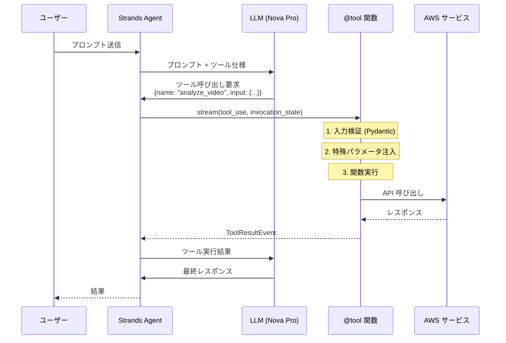
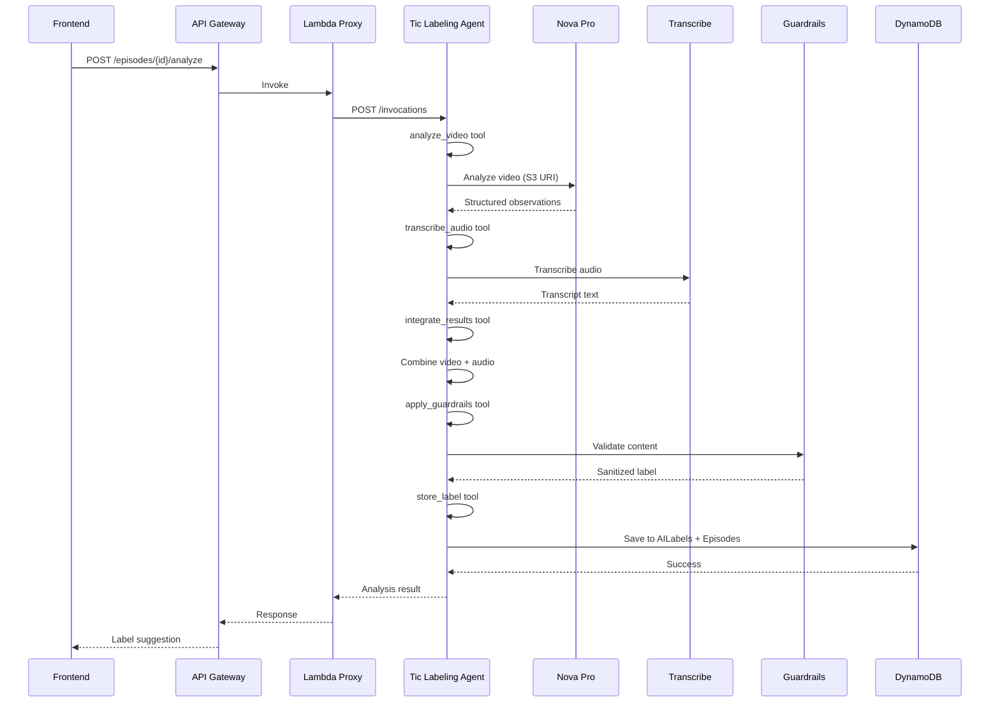

# TicTrack Strands Agent アーキテクチャ設計書

> **バージョン**: 1.0
> **最終更新**: 2026-03-07
> **対象**: TicTrack AI エージェント実装
> **参照**: `docs/design/architecture_final.md`

---

## 1. 概要

TicTrack では、AI による動画分析とガイダンス提供に **Strands Agents SDK + AgentCore Runtime** を採用している。本ドキュメントは、Strands Agent の設計・実装・デプロイメントの詳細を記述する。

### 1.1 Strands Agent とは

Strands Agents SDK は AWS が提供する AI Agent フレームワークで、以下の特徴を持つ:

- **ツールベースアーキテクチャ**: `@tool` デコレータで関数を定義し、Agent が自律的に選択・実行
- **Amazon Bedrock ネイティブ**: Nova Pro、Claude、Guardrails との統合が容易
- **FastAPI ベース**: HTTP エンドポイント経由で Lambda から呼び出し可能
- **Python ファースト**: Python 3.12 で実装

### 1.2 採用理由（ADR-1）

| 項目 | Step Functions + Lambda | Strands Agent |
|------|------------------------|---------------|
| 実装量 | 5 Lambda + SF 定義 | 1 Agent + 6 tools |
| ワークフロー | 明示的な状態遷移 | Agent の自律実行 |
| エラーハンドリング | Catch/Retry 定義 | Agent の自律リトライ |
| デプロイ | Lambda × 5 | Docker × 1 |
| フォールバック | — | Lambda/Bedrock API に段階的回帰可能 |

---

## 2. Strands Agent ツール登録の仕組み

### 2.1 @tool デコレータの役割

Strands Agents SDK の核心は `@tool` デコレータです。このデコレータは Python 関数を Agent が理解・実行できるツールに変換します。

#### 2.1.1 デコレータの動作フロー

```python
from strands import tool

@tool
def analyze_video(s3_key: str, bucket_name: str = "tictrack-media-dev") -> Dict[str, Any]:
    """
    Analyze a video using Amazon Nova Pro.
    
    Args:
        s3_key: The S3 key of the video file
        bucket_name: The S3 bucket name
    
    Returns:
        Dictionary containing structured observations
    """
    # 実装
    return result
```

**デコレータが行う処理**:

1. **メタデータ抽出** (`FunctionToolMetadata`)
   - 関数名、docstring、型ヒントを解析
   - パラメータの名前、型、説明を抽出
   - 戻り値の型情報を取得

2. **Pydantic モデル生成**
   - 関数のシグネチャから入力検証用の Pydantic モデルを自動生成
   - 型ヒント → JSON Schema への変換

3. **ツール仕様の作成** (`ToolSpec`)
   ```json
   {
     "name": "analyze_video",
     "description": "Analyze a video using Amazon Nova Pro.",
     "inputSchema": {
       "json": {
         "type": "object",
         "properties": {
           "s3_key": {
             "type": "string",
             "description": "The S3 key of the video file"
           },
           "bucket_name": {
             "type": "string",
             "description": "The S3 bucket name",
             "default": "tictrack-media-dev"
           }
         },
         "required": ["s3_key"]
       }
     }
   }
   ```

4. **DecoratedFunctionTool の生成**
   - 元の関数を `AgentTool` インターフェースでラップ
   - 通常の関数呼び出しとツール呼び出しの両方をサポート

#### 2.1.2 デコレータの使用パターン

**パターン 1: シンプルなデコレータ**
```python
@tool
def my_tool(param: str) -> str:
    return f"Result: {param}"
```

**パターン 2: カスタム設定**
```python
@tool(
    name="custom_name",
    description="Custom description",
    context=True  # ToolContext を注入
)
def my_tool(param: str, tool_context: ToolContext) -> str:
    tool_id = tool_context["tool_use"]["toolUseId"]
    return f"Result: {param} (ID: {tool_id})"
```

**パターン 3: 型アノテーション付き**
```python
from typing import Annotated

@tool
def my_tool(
    param1: Annotated[str, "Description of param1"],
    param2: Annotated[int, "Description of param2"] = 42
) -> Dict[str, Any]:
    return {"param1": param1, "param2": param2}
```

### 2.2 Agent へのツール登録

#### 2.2.1 基本的な登録方法

```python
from strands import Agent
from .tools import analyze_video, transcribe_audio

# ツールのリストを渡すだけ
agent = Agent(
    tools=[
        analyze_video,
        transcribe_audio,
        integrate_results,
        apply_guardrails,
        store_label,
    ]
)
```

**内部処理**:
1. Agent は各ツールの `tool_spec` プロパティを読み取る
2. ツール名をキーとしてツールレジストリに登録
3. LLM にツール仕様を提供（関数呼び出しの候補として）

#### 2.2.2 ツール呼び出しフロー



#### 2.2.3 入力検証の仕組み

`@tool` デコレータは Pydantic を使用して自動的に入力を検証します:

```python
# ツール定義
@tool
def my_tool(count: int, name: str = "default") -> str:
    return f"{name}: {count}"

# Agent が受け取る tool_use
tool_use = {
    "toolUseId": "123",
    "name": "my_tool",
    "input": {
        "count": "5",  # 文字列だが int に変換される
        "name": "test"
    }
}

# 内部処理:
# 1. Pydantic モデルで検証: {"count": 5, "name": "test"}
# 2. 型変換: count が int に変換される
# 3. 関数呼び出し: my_tool(count=5, name="test")
```

**検証エラーの例**:
```python
# 不正な入力
tool_use = {
    "input": {
        "count": "invalid"  # int に変換できない
    }
}

# エラーレスポンス
{
    "toolUseId": "123",
    "status": "error",
    "content": [{
        "text": "Error: Validation failed for input parameters: ..."
    }]
}
```

### 2.3 特殊パラメータの注入

#### 2.3.1 ToolContext

Agent の実行コンテキストにアクセスする場合:

```python
from strands import tool, ToolContext

@tool(context=True)
def my_tool(param: str, tool_context: ToolContext) -> str:
    # tool_context から情報を取得
    tool_use = tool_context["tool_use"]
    agent = tool_context["agent"]
    invocation_state = tool_context["invocation_state"]
    
    return f"Tool ID: {tool_use['toolUseId']}"
```

**ToolContext の内容**:
```python
{
    "tool_use": {
        "toolUseId": "123",
        "name": "my_tool",
        "input": {...}
    },
    "agent": <Agent instance>,
    "invocation_state": {
        "agent": <Agent instance>,
        # その他の呼び出し時の状態
    }
}
```

#### 2.3.2 Agent インスタンス（後方互換性）

```python
@tool
def my_tool(param: str, agent) -> str:
    # agent パラメータは自動的に注入される
    # （ToolContext を使う方が推奨）
    return f"Agent: {agent}"
```

### 2.4 非同期ツールのサポート

#### 2.4.1 async 関数

```python
@tool
async def async_tool(param: str) -> str:
    await asyncio.sleep(1)
    return f"Result: {param}"
```

#### 2.4.2 async generator（ストリーミング）

```python
@tool
async def streaming_tool(param: str):
    """ストリーミングレスポンスを返すツール"""
    for i in range(5):
        yield {"text": f"Chunk {i}: {param}"}
        await asyncio.sleep(0.5)
    
    # 最後のイベントが最終結果
    yield {
        "status": "success",
        "content": [{"text": "Complete"}]
    }
```

### 2.5 ツールの戻り値フォーマット

#### 2.5.1 標準フォーマット（推奨）

```python
@tool
def my_tool(param: str) -> Dict[str, Any]:
    return {
        "status": "success",  # or "error"
        "content": [
            {"text": "Result text"},
            {"image": {"format": "png", "source": {"bytes": b"..."}}},
        ]
    }
```

#### 2.5.2 自動ラップ

任意の戻り値は自動的に標準フォーマットにラップされます:

```python
@tool
def my_tool(param: str) -> str:
    return "Simple result"

# 自動的に以下に変換:
# {
#     "toolUseId": "123",
#     "status": "success",
#     "content": [{"text": "Simple result"}]
# }
```

### 2.6 エラーハンドリング

```python
@tool
def my_tool(param: str) -> Dict[str, Any]:
    try:
        result = risky_operation(param)
        return {
            "status": "success",
            "content": [{"text": str(result)}]
        }
    except ValueError as e:
        # エラーは自動的にキャッチされ、フォーマットされる
        raise RuntimeError(f"Operation failed: {str(e)}")

# Agent が受け取るエラーレスポンス:
# {
#     "toolUseId": "123",
#     "status": "error",
#     "content": [{
#         "text": "Error: RuntimeError - Operation failed: ..."
#     }]
# }
```

---

## 3. システム構成

### 2.1 全体アーキテクチャ

```
┌─────────────────────────────────────────────────────────────┐
│                        Frontend (Next.js)                    │
└────────────────────┬────────────────────────────────────────┘
                     │ API Gateway
                     ▼
┌─────────────────────────────────────────────────────────────┐
│              Lambda Proxy (Node.js 20)                       │
│  - API Gateway からのリクエスト受信                           │
│  - AgentCore への HTTP 呼び出し                              │
│  - DynamoDB 更新                                             │
└────────────────────┬────────────────────────────────────────┘
                     │ HTTP POST /invocations
                     ▼
┌─────────────────────────────────────────────────────────────┐
│         AgentCore Runtime (Docker Container)                 │
│  ┌───────────────────────────────────────────────────────┐  │
│  │  Tic Labeling Agent (Python 3.12)                     │  │
│  │  - FastAPI エンドポイント                              │  │
│  │  - Strands Agent 実行エンジン                          │  │
│  │  - 6 つの @tool 関数                                   │  │
│  └───────────────────────────────────────────────────────┘  │
│  ┌───────────────────────────────────────────────────────┐  │
│  │  Micro-Guide Agent (Python 3.12)                      │  │
│  │  - RAG ベースガイダンス                                │  │
│  │  - 3 つの @tool 関数                                   │  │
│  └───────────────────────────────────────────────────────┘  │
└────────────────────┬────────────────────────────────────────┘
                     │
        ┌────────────┼────────────┬──────────────┐
        ▼            ▼            ▼              ▼
   ┌────────┐  ┌─────────┐  ┌──────────┐  ┌──────────┐
   │ Nova   │  │ Claude  │  │Transcribe│  │DynamoDB  │
   │ Pro    │  │ Haiku   │  │          │  │          │
   └────────┘  └─────────┘  └──────────┘  └──────────┘
        │            │
        └────────────┴─────────────┐
                                   ▼
                          ┌──────────────┐
                          │  Bedrock     │
                          │  Guardrails  │
                          └──────────────┘
```

### 2.2 デュアル言語構成

| 領域 | 言語 | 理由 |
|------|------|------|
| AI Agents (`agents/`) | **Python 3.12** | Strands SDK は Python ファースト |
| CRUD APIs (`amplify/functions/`) | **Node.js 20** | Amplify Gen 2 ネイティブ |
| Frontend (`src/`) | **TypeScript** | Next.js |

---

## 3. Tic Labeling Agent

### 3.1 責務

動画エピソードを分析し、構造化されたラベル（type, severity, context）を提案する。

### 3.2 Agent 定義

**ファイル**: `agents/tic_labeling/agent.py`

```python
from fastapi import FastAPI
from strands import Agent
from .tools import (
    analyze_video,
    transcribe_audio,
    integrate_results,
    apply_guardrails,
    store_label,
)

app = FastAPI(
    title="TicTrack Tic Labeling Agent",
    description="AI-powered tic symptom analysis",
    version="1.0.0",
)

AGENT_INSTRUCTIONS = """
あなたはチック症状の観察アシスタントです。

【タスク】
1. analyze_video で動画を分析
2. transcribe_audio で音声を文字起こし
3. integrate_results で結果を統合
4. apply_guardrails で安全性を確保
5. store_label で DynamoDB に保存

【重要な制約】
- 診断は行わない
- 治療助言は行わない
- 観察的表現のみ使用（「〜のように見える」等）
"""

agent = Agent(
    tools=[
        analyze_video,
        transcribe_audio,
        integrate_results,
        apply_guardrails,
        store_label,
    ],
    callback_handler=None,
)

@app.post("/invocations")
async def analyze_tic_episode(request: AnalyzeRequest):
    prompt = f"""{AGENT_INSTRUCTIONS}
    
    エピソード ID: {request.episode_id}
    子ども ID: {request.child_id}
    S3 Key: {request.s3_key}
    """
    
    result = None
    async for event in agent.stream_async(prompt):
        if event.get("type") == "agent_finish":
            result = event.get("data", {})
    
    return AnalyzeResponse(
        episode_id=request.episode_id,
        status="completed",
        label=result,
    )
```

### 3.3 ツール一覧

#### 3.3.1 analyze_video

**ファイル**: `agents/tic_labeling/tools/analyze_video.py`

**責務**: Amazon Nova Pro を使用して動画を分析し、チック症状の観察結果を構造化 JSON で返す。

**入力**:
- `s3_key`: 動画の S3 キー
- `bucket_name`: S3 バケット名（デフォルト: `tictrack-media-dev`）

**出力**:
```json
{
  "observations": [
    {
      "timestamp": "0:05",
      "description": "Observable movement description",
      "intensity": "low|medium|high"
    }
  ],
  "suggested_type": "motor|vocal|both",
  "suggested_severity": 1-3,
  "confidence": 0.0-1.0
}
```

**使用サービス**: Amazon Bedrock (Nova Pro)

**実装のポイント**:
- Nova Pro は S3 URI を直接入力可能
- 動画は 672×672 にリサイズされる
- 10秒動画 ≈ 2,880 トークン、20秒 ≈ 5,760 トークン
- Temperature: 0.2（一貫性重視）

#### 3.3.2 transcribe_audio

**ファイル**: `agents/tic_labeling/tools/transcribe_audio.py`

**責務**: Amazon Transcribe を使用して動画の音声を文字起こしし、音声チック検出を補助する。

**入力**:
- `s3_key`: 動画の S3 キー
- `bucket_name`: S3 バケット名
- `language_code`: 言語コード（デフォルト: `ja-JP`）

**出力**:
```json
{
  "transcript": "Full transcribed text",
  "has_audio": true/false,
  "detected_sounds": ["sound1", "sound2"],
  "vocal_tics_detected": true/false
}
```

**使用サービス**: Amazon Transcribe

**実装のポイント**:
- 非同期ジョブとして実行（最大 5 分待機）
- 音声がない場合は空の結果を返す（エラーにしない）
- Free Tier: 月 60 分まで無料

#### 3.3.3 integrate_results

**ファイル**: `agents/tic_labeling/tools/integrate_results.py`

**責務**: 動画分析結果と音声文字起こし結果を統合し、最終的なラベルを生成する。

**入力**:
- `video_analysis`: analyze_video の出力
- `audio_transcription`: transcribe_audio の出力

**出力**:
```json
{
  "type": "motor|vocal|both",
  "severity": 1-3,
  "context": "description",
  "observations": [...],
  "confidence": 0.0-1.0,
  "metadata": {
    "video_analysis": {...},
    "audio_analysis": {...}
  }
}
```

**使用サービス**: なし（ローカル処理）

**実装のポイント**:
- 動画と音声の両方から type を決定
- 観察数と音声チックの有無で severity を調整
- confidence スコアを計算

#### 3.3.4 apply_guardrails

**ファイル**: `agents/tic_labeling/tools/apply_guardrails.py`

**責務**: Bedrock Guardrails を適用し、診断的表現や治療助言を除去する。

**入力**:
- `label_data`: 統合されたラベルデータ

**出力**:
```json
{
  "label": {...},
  "guardrail_passed": true/false,
  "blocked_content": [...],
  "action_taken": "NONE|BLOCKED|SANITIZED"
}
```

**使用サービス**: Amazon Bedrock Guardrails

**実装のポイント**:
- Guardrail が未設定の場合はフォールバック検証を使用
- 禁止キーワード: 診断、治療、薬、原因、悪化 等
- ブロックされた内容は観察的表現に置換

#### 3.3.5 store_label

**ファイル**: `agents/tic_labeling/tools/store_label.py`

**責務**: AI ラベルを DynamoDB に保存する。

**入力**:
- `episode_id`: エピソード ID
- `child_id`: 子ども ID
- `label_data`: ラベルデータ
- `guardrail_result`: Guardrail 結果

**出力**:
```json
{
  "ai_label_id": "...",
  "episode_updated": true/false,
  "status": "completed"
}
```

**使用サービス**: Amazon DynamoDB

**実装のポイント**:
- AILabels テーブルに保存
- Episodes テーブルの `labelStatus` を `ai_suggested` に更新
- `originalAILabel` フィールドに AI 提案を記録

### 3.4 実行フロー



---

## 4. Micro-Guide Agent

### 4.1 責務

保護者からの質問に対して、RAG（Retrieval-Augmented Generation）を使用して信頼できる情報源に基づいたガイダンスを提供する。

### 4.2 Agent 定義

**ファイル**: `agents/micro_guide/agent.py`

```python
from fastapi import FastAPI
from strands import Agent
from .tools import (
    retrieve_knowledge_base,
    format_guidance,
    apply_guardrails,
)

app = FastAPI(
    title="TicTrack Micro-Guide Agent",
    description="RAG-based caregiver guidance",
    version="1.0.0",
)

agent = Agent(
    tools=[
        retrieve_knowledge_base,
        format_guidance,
        apply_guardrails,
    ],
)
```

### 4.3 ツール一覧

#### 4.3.1 retrieve_knowledge_base

**責務**: Bedrock Knowledge Bases を使用して関連情報を検索する。

**入力**:
- `query`: ユーザーの質問
- `category`: カテゴリ（optional）

**出力**:
```json
{
  "results": [
    {
      "content": "...",
      "source": "...",
      "relevance_score": 0.0-1.0
    }
  ]
}
```

**使用サービス**: Amazon Bedrock Knowledge Bases + S3 Vectors

#### 4.3.2 format_guidance

**責務**: 検索結果を保護者向けのガイダンスにフォーマットする。

**入力**:
- `query`: 元の質問
- `retrieved_content`: 検索結果

**出力**:
```json
{
  "guidance": "Formatted guidance text",
  "sources": ["source1", "source2"]
}
```

#### 4.3.3 apply_guardrails

Tic Labeling Agent と同じツールを使用。

---

## 5. デプロイメント

### 5.1 Docker コンテナ構成

**ファイル**: `agents/Dockerfile`

```dockerfile
FROM python:3.12-slim

WORKDIR /app

COPY pyproject.toml .
RUN pip install --no-cache-dir .

COPY . .

EXPOSE 8080
CMD ["uvicorn", "tic_labeling.agent:app", "--host", "0.0.0.0", "--port", "8080"]
```

### 5.2 依存関係管理

**ファイル**: `agents/pyproject.toml`

```toml
[project]
name = "tictrack-agents"
version = "0.1.0"
description = "TicTrack AI Agents - Strands Agents SDK"
requires-python = ">=3.12"
dependencies = [
    "strands-agents>=0.1.0",
    "strands-agents-tools>=0.1.0",
    "fastapi>=0.115.0",
    "uvicorn[standard]>=0.34.0",
    "boto3>=1.37.0",
]

[project.optional-dependencies]
dev = [
    "pytest>=8.0.0",
    "moto[all]>=5.0.0",
    "pytest-asyncio>=0.24.0",
    "httpx>=0.28.0",
]
```

### 5.3 ECR + Lambda デプロイ

```
1. Docker イメージをビルド
   $ docker build -t tictrack-agents:latest agents/

2. ECR にプッシュ
   $ aws ecr get-login-password | docker login --username AWS --password-stdin {account}.dkr.ecr.us-east-1.amazonaws.com
   $ docker tag tictrack-agents:latest {account}.dkr.ecr.us-east-1.amazonaws.com/tictrack-agents:latest
   $ docker push {account}.dkr.ecr.us-east-1.amazonaws.com/tictrack-agents:latest

3. Lambda 関数を作成（コンテナイメージ）
   - ランタイム: コンテナイメージ
   - アーキテクチャ: ARM64
   - メモリ: 2048 MB
   - タイムアウト: 5 分
   - 環境変数:
     - DYNAMODB_TABLE_PREFIX=tictrack-dev
     - S3_MEDIA_BUCKET=tictrack-media-dev
```

### 5.4 Lambda Proxy 実装

**ファイル**: `amplify/functions/ai-proxy/handler.ts`

```typescript
import { Handler } from 'aws-lambda';
import axios from 'axios';

const AGENT_ENDPOINT = process.env.AGENT_ENDPOINT!;

export const handler: Handler = async (event) => {
  const { episodeId, childId, s3Key, videoMimeType } = JSON.parse(event.body);
  
  try {
    const response = await axios.post(`${AGENT_ENDPOINT}/invocations`, {
      episode_id: episodeId,
      child_id: childId,
      s3_key: s3Key,
      video_mime_type: videoMimeType,
    });
    
    return {
      statusCode: 200,
      body: JSON.stringify(response.data),
    };
  } catch (error) {
    console.error('Agent invocation failed:', error);
    return {
      statusCode: 500,
      body: JSON.stringify({ error: 'Analysis failed' }),
    };
  }
};
```

---

## 6. テスト戦略

### 6.1 ユニットテスト

**フレームワーク**: pytest + moto

**テストファイル**: `agents/tests/`

```
agents/tests/
├── test_analyze_video.py      # Nova Pro 呼び出しのモック
├── test_transcribe_audio.py   # Transcribe のモック
├── test_guardrails.py         # Guardrails のモック
└── test_store_label.py        # DynamoDB のモック
```

**実行**:
```bash
cd agents
pytest
```

### 6.2 統合テスト

**アプローチ**: 実際の Bedrock サービスを使用した E2E テスト

```python
@pytest.mark.integration
def test_full_labeling_pipeline():
    # 実際の S3 動画をアップロード
    # Agent を呼び出し
    # DynamoDB の結果を検証
```

### 6.3 テストカバレッジ目標

| コンポーネント | カバレッジ目標 |
|---------------|---------------|
| ツール関数 | 80% 以上 |
| Agent 定義 | 60% 以上 |
| エラーハンドリング | 100% |

---

## 7. モニタリングとロギング

### 7.1 ログ構造

```python
import logging

logger = logging.getLogger(__name__)
logger.setLevel(logging.INFO)

# 各ツールでログを出力
logger.info(f"Analyzing video: {s3_key}")
logger.error(f"Error analyzing video: {str(e)}")
```

### 7.2 CloudWatch メトリクス

| メトリクス | 説明 |
|-----------|------|
| `AgentInvocations` | Agent 呼び出し回数 |
| `ToolExecutions` | 各ツールの実行回数 |
| `ProcessingTimeMs` | 処理時間 |
| `GuardrailBlocks` | Guardrails によるブロック回数 |
| `Errors` | エラー発生回数 |

### 7.3 アラート設定

| アラート | 条件 | アクション |
|---------|------|----------|
| 高エラー率 | エラー率 > 10% | SNS 通知 |
| 長時間処理 | 処理時間 > 3 分 | SNS 通知 |
| Guardrail 高頻度ブロック | ブロック率 > 20% | レビュー必要 |

---

## 8. コスト見積もり

### 8.1 Bedrock コスト（$200 クレジット使用）

| サービス | 使用量 | 単価 | 月額コスト |
|---------|-------|------|----------|
| Nova Pro | 100 動画 × 5,000 トークン | $0.80/1M トークン | $0.40 |
| Claude Haiku | 100 リクエスト × 500 トークン | $0.25/1M トークン | $0.01 |
| Transcribe | 100 動画 × 15 秒 = 25 分 | Free Tier | $0.00 |
| Guardrails | 200 リクエスト | $0.75/1000 リクエスト | $0.15 |
| **合計** | | | **$0.56/月** |

### 8.2 Lambda コスト

| 項目 | 値 |
|------|-----|
| メモリ | 2048 MB |
| 実行時間 | 平均 30 秒 |
| 月間実行回数 | 100 回 |
| **月額コスト** | **Free Tier 内** |

---

## 9. フォールバック戦略

Strands Agent が期待通りに動作しない場合の段階的フォールバック:

### Phase 1: Strands Agent（現在）
- Agent が自律的にツールを選択・実行

### Phase 2: Lambda Python + Bedrock SDK
- Agent を使わず、Lambda 内で直接 Bedrock API を呼び出し
- ツール関数はそのまま流用可能

### Phase 3: Step Functions + Lambda
- 決定論的なワークフローに回帰
- 各ツールを独立した Lambda 関数として実装

---

## 10. 今後の拡張

### 10.1 マルチモーダル分析
- 画像（静止画）からのチック検出
- 音声のみの分析（動画なし）

### 10.2 継続学習
- ユーザーフィードバックを使用したモデルの微調整
- カスタムモデルのトレーニング

### 10.3 リアルタイム分析
- ストリーミング動画の分析
- WebSocket 経由のリアルタイムフィードバック

---

## 11. 参考資料

- [Strands Agents SDK ドキュメント](https://docs.aws.amazon.com/bedrock/latest/userguide/agents.html)
- [Amazon Nova Pro 仕様](https://docs.aws.amazon.com/bedrock/latest/userguide/model-parameters-nova.html)
- [Amazon Transcribe ドキュメント](https://docs.aws.amazon.com/transcribe/)
- [Bedrock Guardrails ガイド](https://docs.aws.amazon.com/bedrock/latest/userguide/guardrails.html)
