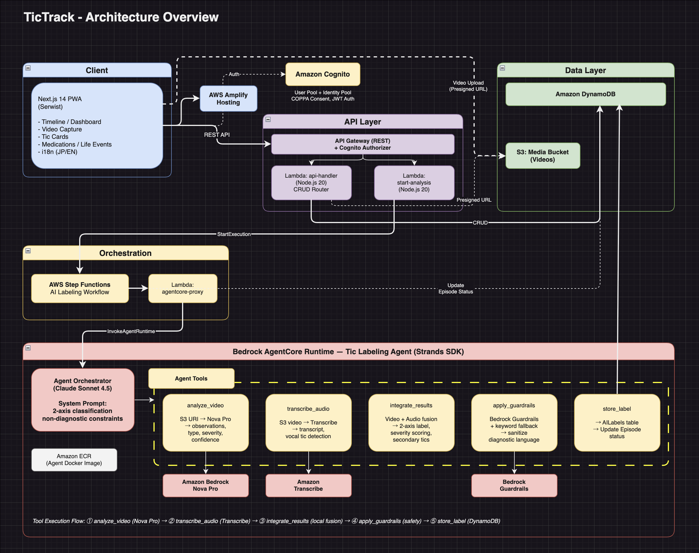

# AIdeas: TicTrack

> **カテゴリ**: Daily Life Enhancement
> **タグ**: #aideas-2025, #daily-life-enhancement, #APJC
> **チーム名**: TicTrack
> **カバー画像**: （別途作成）

---

## App Category

Daily Life Enhancement

## My Vision

子どもにチックの兆候が見られたとき、保護者は「いつ起きるのか」「どのくらいの頻度なのか」を正確に把握し、医療者に伝えることに苦労します。症状は変動し、常に見守ることはできず、記録には必ず見逃しが生じます。そして何より、医療の専門知識がない保護者にとって、チック症状を言葉で正確に表現すること自体が非常に難しいのです。

TicTrack は、この課題を解決する caregiver-first / non-diagnostic なアプリケーションです。

**動画からの AI 自動ラベリング** が TicTrack の核です。保護者がスマートフォンで 10〜20 秒の短い動画を撮影すると、Amazon Bedrock の Nova Pro モデルが動画を解析し、症状名・種類（運動性/音声性）・複雑性・強度・信頼度・タイムスタンプ付き観察内容を構造化ラベルとして自動提案します。保護者が「あの動き、なんて表現すればいいんだろう」と悩む必要はもうありません。

すでに把握している症状については、**チックカード** として登録しておくことで、ワンタップで記録できます。新しい症状は動画 + AI で、既知の症状はワンタップで。この二つの記録手段を組み合わせることで、日常の中で無理なく記録を続けられます。

さらに、服薬状況や生活イベント（転校・引っ越し等）もストレスレベルとともに記録でき、**ダッシュボード** でタイプ分布・重症度分布・時間帯パターンなどの傾向を可視化します。この情報は医療機関への受診時にそのまま活用でき、「最近どうですか？」と聞かれたとき、記憶ではなくデータに基づいて説明できます。

### 主な機能

- **動画撮影 + AI 自動ラベリング**: Amazon Bedrock Nova Pro による動画解析と構造化ラベル提案
- **チックカード**: よく見られる症状のワンタップ記録
- **タイムライン**: カレンダー表示で記録を振り返り
- **投薬管理**: 服薬状況のワンタップ記録
- **出来事記録**: 生活イベントとストレスレベルの記録
- **ダッシュボード**: 統計的な傾向可視化と医療機関向け情報提供
- **デモモード**: サインアップ不要でアプリを体験
- **PWA**: アプリストア不要、スマートフォンのブラウザから利用可能

## Why This Matters

私自身、息子のチック症状に直面し、「いつ・どのくらい起きているか」を説明することの難しさと不安を強く感じました。これは私だけの問題ではありません。

**子どもの 5 人に 1 人** が成長の過程で何らかのチック症状を経験するといわれています。決して珍しいことではないのに、保護者を支える記録ツールはほとんど存在しません。

既存のセルフトラッキングツールは、本人が自覚して記録することを前提としていますが、保護者には異なるアプローチが必要です。子どもの症状を 24 時間観察することは不可能で、見逃し（欠測）は避けられません。TicTrack は、この **missing-data tolerant**（欠測に強い）設計を前提としています。

TicTrack がもたらす価値:

- **保護者の負担軽減**: ワンタップ記録と AI 自動ラベリングで、記録の摩擦を最小化
- **症状の言語化支援**: AI が医療者にも伝わる構造化情報を生成し、「説明できない」不安を解消
- **医療者との連携改善**: データに基づく受診で、限られた診察時間を有効活用
- **文脈の記録**: 服薬や生活環境の変化と症状の関連を可視化

本アプリは **non-diagnostic**（診断・治療助言は行わない）です。AI はあくまで提案であり、最終的な確認や修正は保護者自身が行います。

## How I Built This

### アーキテクチャ概要

TicTrack は AWS のサーバーレスアーキテクチャを基盤に、デュアル言語構成で構築しています。CRUD API は Node.js 20、AI エージェントは Python 3.12 です。

<!-- TODO: アーキテクチャ図を挿入 -->

**データフロー:**

1. **フロントエンド**: Next.js 14 PWA（Serwist）が Amplify Hosting 上で動作
2. **認証**: Amazon Cognito で保護者の認証・認可を管理（COPPA 同意フラグ付き）
3. **API**: API Gateway + Cognito Authorizer を経由し、Lambda (api-handler) が CRUD 処理を実行
4. **データ保存**: DynamoDB に 12 テーブル（Users, Children, TicCards, Episodes, AILabels 等）、動画は S3 に保存
5. **AI 分析ワークフロー**: 動画アップロード後、Step Functions がオーケストレーションを実行。AgentCore Runtime 上の Strands Agent が Nova Pro で動画を解析し、構造化ラベルを DynamoDB に保存

### AWS サービス一覧

| サービス | 用途 |
|---------|------|
| **AWS Amplify Hosting** | Next.js PWA のホスティング・CI/CD |
| **Amazon Cognito** | 認証（User Pool + Identity Pool）、COPPA 同意管理 |
| **Amazon API Gateway** | REST API、Cognito Authorizer によるルーティング |
| **AWS Lambda** | CRUD API ハンドラー (Node.js)、AI プロキシ (Node.js)、分析起動 |
| **Amazon DynamoDB** | 12 テーブル、PAY_PER_REQUEST、GSI による柔軟なクエリ |
| **Amazon S3** | 動画保存（Presigned URL）、ナレッジベース、ライフサイクルルール |
| **AWS Step Functions** | AI ラベリングワークフローのオーケストレーション（リトライ・エラーハンドリング） |
| **Amazon Bedrock** | Nova Pro（動画解析）、Claude Haiku（テキスト生成）、Guardrails（non-diagnostic 制約） |
| **Bedrock AgentCore Runtime** | Strands Agents SDK による AI エージェントのマネージド実行環境 |
| **Amazon ECR** | AI エージェントの Docker イメージ管理 |
| **Amazon CloudWatch** | Lambda・Step Functions・AgentCore のログ監視 |
| **AWS CDK** | Amplify Gen 2 + カスタム CDK コンストラクトによる IaC |

### 主要な技術的決定

**1. デュアル言語アーキテクチャ（Node.js + Python）**

CRUD API は Amplify Gen 2 と親和性の高い Node.js 20 で実装し、AI エージェントは Strands Agents SDK（Python ファースト）で実装しました。関心の分離が明確になり、それぞれの言語エコシステムの強みを活かせています。

**2. 動画解析に Nova Pro を採用**

動画のマルチモーダル解析には Amazon Nova Pro を選択しました。S3 URI からの直接入力に対応しており、動画のダウンロードやエンコードが不要です。コストは 1 動画あたり約 $0.004 と非常に低く、プロトタイプに最適です。

**3. Step Functions によるワークフロー管理**

AI 分析は非同期処理であり、タイムアウト・リトライ・エラーハンドリングが必要です。Step Functions により、これらを宣言的に定義でき、Lambda のコードをシンプルに保てます。失敗時は自動的にエピソードのステータスを "failed" に更新します。

**4. Amplify Gen 2 + CDK カスタムコンストラクト**

Amplify Gen 2 は認証・ストレージ・ホスティングを簡単にセットアップでき、CDK カスタムコンストラクトで DynamoDB テーブル・API Gateway・Step Functions などを追加できます。一つの `backend.ts` からすべてのインフラを管理し、段階的にリソースを有効化する staged activation パターンを採用しました。

**5. マルチテーブル DynamoDB 設計**

プロトタイプ段階では Single-Table Design ではなく、ドメインモデルに直接対応するマルチテーブル設計を採用しました。可読性と開発速度を優先し、GSI で必要なクエリパターンをカバーしています。

### Kiro を使った開発

TicTrack の開発では、Kiro IDE の仕様駆動開発（Spec-driven Development）ワークフローを活用しました。

**Steering Files によるプロジェクトコンテキストの確立:**
開発の初期段階で、Kiro の Steering Files にプロダクト概要・技術スタック・ディレクトリ構成を定義しました。これにより、Kiro のエージェントがプロジェクトのコンテキストを正確に理解した上でコード生成やリファクタリングを支援してくれました。

**Specs による設計の事前定義:**
各実装ステップの要件を EARS 形式で定義し、アーキテクチャ設計と実装タスクを Kiro の Specs として管理しました。これにより、コードを書く前に要件・受け入れ条件・テスト項目が明確になり、TDD アプローチとの相性が良好でした。

**Agent Hooks による自動化:**
Kiro の Agent Hooks を活用し、コード変更時のテスト自動実行、CDK バリデーション、型の整合性チェックなどを自動化しました。

仕様駆動のアプローチにより、10 ステップの実装ロードマップに沿って段階的に機能を追加でき、スコープクリープを防ぎながら 29 日間の開発期間内で MVP を完成させることができました。

## Demo

<!-- TODO: YouTube 動画を埋め込み -->
<!-- YouTube embed: https://youtu.be/XXXXX -->

以下のスクリーンショットで、TicTrack の主要な機能フローを紹介します。

### スクリーンショット 1 — 認証とチックカード登録

<!-- TODO: スクリーンショット挿入 -->

メールアドレスでサインアップし、子どものプロフィールを登録。チックカードとして症状（種類・複雑性・強度）を設定します。

### スクリーンショット 2 — ワンタップ記録

<!-- TODO: スクリーンショット挿入 -->

登録したチックカードの「記録」ボタンをワンタップするだけで、いつ・何が起きたかを瞬時に記録。スマートフォンでの片手操作に最適化されたデザインです。

### スクリーンショット 3 — 動画撮影

<!-- TODO: スクリーンショット挿入 -->

ヘッダーの「動画を撮影」ボタンからいつでも撮影開始。最長 20 秒のカウントダウン付きで、短時間で確実に記録できます。

### スクリーンショット 4 — AI 自動ラベリング結果

<!-- TODO: スクリーンショット挿入 -->

Amazon Bedrock Nova Pro が動画を解析し、症状名・種類・複雑性・強度・信頼度・タイムスタンプ付き観察内容を構造化ラベルとして提案。保護者はワンタップで確認、または修正できます。

### スクリーンショット 5 — タイムラインとカレンダー

<!-- TODO: スクリーンショット挿入 -->

カレンダー上に記録件数がバッジで表示され、日付をタップすると時系列で全記録を確認できます。

### スクリーンショット 6 — ダッシュボード

<!-- TODO: スクリーンショット挿入 -->

タイプ分布、重症度分布、時間帯パターン、頻出チック上位 5 つのチャートで傾向をひと目で把握。医療機関への受診時にそのまま活用できます。

### スクリーンショット 7 — Kiro による開発ワークフロー

<!-- TODO: Kiro のスクリーンショット挿入 -->

Kiro の Specs パネルで要件と実装タスクを管理し、仕様駆動開発で段階的に機能を実装しました。

## What I Learned

### 1. AI の制約設計が最も重要

TicTrack は non-diagnostic アプリです。AI が何を「しない」かの設計が、何を「する」かよりも重要でした。診断や治療助言を行わない制約は、Bedrock Guardrails とプロンプト設計の両方で担保しています。ヘルスケア領域での AI 活用において、安全な制約設計の重要性を学びました。

### 2. 欠測を前提とした設計思想

一般的なトラッキングアプリは「すべてのデータが揃っている」ことを前提としますが、チック症状の記録では見逃しが必然です。「記録できた範囲から傾向を読み取る」という missing-data tolerant な設計思想は、ダッシュボードの統計表示や将来の週次レポート生成において一貫して適用しています。

### 3. デュアル言語アーキテクチャの実用性

Node.js と Python のデュアル言語構成は、一見複雑に見えますが、実際には関心の分離が明確になりました。CRUD API は Amplify Gen 2 のエコシステムに自然に統合でき、AI エージェントは Strands SDK の Python ファーストな設計をそのまま活かせました。異なる言語のベストプラクティスを各レイヤーで適用できることは大きな利点です。

### 4. Step Functions によるワークフロー管理の威力

AI 分析は外部サービス呼び出しを含む非同期処理であり、タイムアウト・リトライ・部分失敗への対処が必要です。当初は Lambda 内でこれらを管理しようとしましたが、Step Functions に移行することで、リトライポリシーやエラーハンドリングを宣言的に定義でき、Lambda のコードが大幅にシンプルになりました。

### 5. Nova Pro の動画解析能力

Amazon Nova Pro は S3 URI から直接動画を入力でき、フレーム抽出やエンコードの前処理が不要です。チック症状のような微細な身体動作を検出する能力は想定以上に高く、タイムスタンプ付きの観察内容まで出力できます。1 動画あたり約 $0.004 というコストも、プロトタイプからプロダクションへのスケーリングを現実的にしています。

### 6. Amplify Gen 2 + CDK の段階的構築

Amplify Gen 2 は認証やストレージを素早くセットアップでき、CDK カスタムコンストラクトで自由度の高いリソース定義ができます。`backend.ts` での staged activation パターンにより、10 ステップの実装ロードマップに沿って段階的にインフラを有効化でき、29 日間という限られた開発期間でも確実に動くプロトタイプを段階的に成長させることができました。

---

**Tags**: #aideas-2025 #daily-life-enhancement #APJC

**Team**: TicTrack

**Contact**: kzk-maeda
